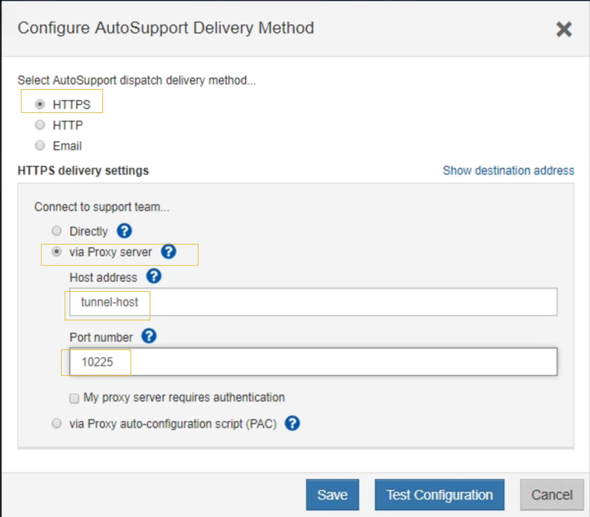

= Senden Sie AutoSupport Nachrichten aus der E-Series über StorageGRID
:allow-uri-read: 
:icons: font
:imagesdir: ../media/

[role="lead"]
Sie können AutoSupport Meldungen von E-Series SANtricity System Manager über einen StorageGRID Admin-Node anstelle des Storage Appliance Management-Ports an den technischen Support senden.

Siehe https://docs.netapp.com/us-en/e-series-santricity/sm-support/autosupport-feature-overview.html["E-Series Hardware AutoSupport"^] Weitere Informationen zur Verwendung von AutoSupport mit E-Series Appliances

.Bevor Sie beginnen
* Sie sind im Grid Manager mit einem angemeldet link:../admin/web-browser-requirements.html["Unterstützter Webbrowser"].
* Sie verfügen über Administratorrechte oder Root-Zugriffsberechtigungen für die Storage-Appliance.
* Sie haben SANtricity AutoSupport konfiguriert:
+
** Für SG6000 und SG5700 Appliances, link:../installconfig/accessing-and-configuring-santricity-system-manager.html["Konfigurieren Sie AutoSupport in SANtricity System Manager"]

NOTE: Sie müssen über SANtricity-Firmware 8.70 oder höher verfügen, um mit dem Grid Manager auf SANtricity System Manager zuzugreifen.

.Über diese Aufgabe
E-Series AutoSupport-Meldungen enthalten Details zur Storage Hardware und sind spezifischer als andere AutoSupport-Meldungen, die vom StorageGRID System gesendet werden.

Sie können eine spezielle Proxy-Server-Adresse in SANtricity System Manager konfigurieren, um AutoSupport-Meldungen über einen StorageGRID-Admin-Knoten ohne Verwendung des Management-Ports der Appliance zu übertragen. AutoSupport-Nachrichten, die auf diese Weise übertragen werden, werden vom gesendet link:../admin/what-admin-node-is.html["Administratorknoten des bevorzugten Absenders"], Und sie verwenden jede link:../admin/configuring-admin-proxy-settings.html["Administrator-Proxy-Einstellungen"] Die im Grid Manager konfiguriert wurden.

NOTE: Dieses Verfahren dient nur zur Konfiguration eines StorageGRID-Proxyservers für AutoSupport-Meldungen der E-Serie. Weitere Informationen zur Konfiguration der E-Series AutoSupport finden Sie unter https://mysupport.netapp.com/info/web/ECMP1658252.html["NetApp E-Series und SANtricity Dokumentation"^].

.Schritte
. Wählen Sie im Grid Manager die Option *NODES* aus.
. Wählen Sie in der Liste der Knoten links den Speicher-Appliance-Node aus, den Sie konfigurieren möchten.
. Wählen Sie *SANtricity System Manager*.
+
Die Startseite von SANtricity System Manager wird angezeigt.

+
image::../media/autosupport_santricity_home_page.png[Startseite von AutoSupport SANtricity]

. Wählen Sie *SUPPORT* > *Support Center* > *AutoSupport*.
+
Die Seite AutoSupport-Vorgänge wird angezeigt.

+
image::../media/autosupport_santricity_operations.png[AutoSupport SANtricity AutoSupport Betrieb]

. Wählen Sie *AutoSupport-Bereitstellungsmethode konfigurieren*.
+
Die Seite AutoSupport-Bereitstellungsmethode konfigurieren wird angezeigt.

+

. Wählen Sie *HTTPS* für die Liefermethode aus.
+

NOTE: Das Zertifikat, das HTTPS aktiviert, ist vorinstalliert.

. Wählen Sie *über Proxy-Server*.
. Eingabe `tunnel-host` Für die *Host-Adresse*.
+
`tunnel-host` Hat die besondere Adresse, um einen Admin-Node zum Senden von E-Series AutoSupport Meldungen zu verwenden.

. Eingabe `10225` Für die * Portnummer*.
+
`10225` Ist die Portnummer auf dem StorageGRID Proxy-Server, der AutoSupport Meldungen vom E-Series Controller in der Appliance empfängt.

. Wählen Sie *Testkonfiguration* aus, um die Routing- und Konfigurationseinstellungen Ihres AutoSupport Proxy-Servers zu testen.
+
Falls richtig, erscheint eine Meldung in einem grünen Banner: „`Ihre AutoSupport-Konfiguration wurde verifiziert.`“

+
Wenn der Test fehlschlägt, wird eine Fehlermeldung in einem roten Banner angezeigt. Überprüfen Sie Ihre StorageGRID-DNS-Einstellungen und Netzwerk, stellen Sie sicher, dass die link:../admin/what-admin-node-is.html["Administratorknoten des bevorzugten Absenders"] Kann eine Verbindung zur NetApp Support Site herstellen und den Test erneut versuchen.

. Wählen Sie *Speichern*.
+
Die Konfiguration wird gespeichert, und es wird eine Bestätigungsmeldung angezeigt: „`AutoSupport-Bereitstellungsmethode wurde konfiguriert.`“

