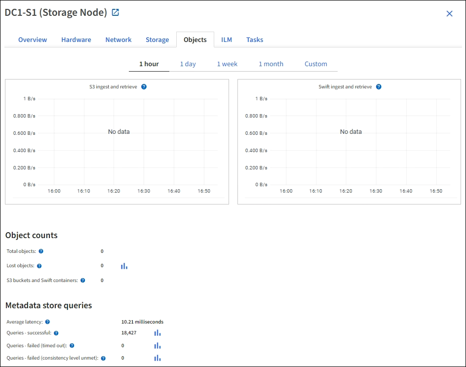

= Was ist ein Storage-Node?
:allow-uri-read: 
:icons: font
:imagesdir: ../media/

[role="lead"]
Storage-Nodes managen und speichern Objektdaten und Metadaten. Jedes StorageGRID System muss mindestens drei Storage-Nodes aufweisen. Wenn Sie über mehrere Standorte verfügen, muss jeder Standort im StorageGRID System auch drei Storage-Nodes aufweisen.

Ein Storage Node umfasst die Services und Prozesse, die zum Speichern, Verschieben, Überprüfen und Abrufen von Objektdaten und Metadaten auf der Festplatte erforderlich sind. Auf der Seite *NODES* können Sie detaillierte Informationen zu den Speicherknoten anzeigen.

== Was ist der ADC-Dienst?

Der Dienst Administrative Domain Controller (ADC) authentifiziert Grid-Knoten und ihre Verbindungen miteinander. Der ADC-Service wird auf jedem der ersten drei Storage-Nodes an einem Standort gehostet.

Der ADC-Dienst verwaltet Topologiedaten, einschließlich Standort und Verfügbarkeit von Diensten. Wenn ein Grid-Knoten Informationen von einem anderen Grid-Knoten benötigt oder eine Aktion von einem anderen Grid-Knoten ausgeführt werden muss, kontaktiert er einen ADC-Service, um den besten Grid-Knoten für die Bearbeitung seiner Anforderung zu finden. Darüber hinaus behält der ADC-Dienst eine Kopie der Konfigurationspakete der StorageGRID-Bereitstellung bei, sodass jeder Grid-Knoten aktuelle Konfigurationsinformationen abrufen kann.ADC-Informationen für einen Speicherknoten können Sie auf der Seite Grid Topology anzeigen (*SUPPORT* > *Grid Topology*).

Zur Erleichterung von verteilten und isanded-Operationen synchronisiert jeder ADC-Dienst Zertifikate, Konfigurationspakete und Informationen über Services und Topologie mit den anderen ADC-Diensten im StorageGRID-System.

Im Allgemeinen unterhalten alle Rasterknoten eine Verbindung zu mindestens einem ADC-Dienst. So wird sichergestellt, dass die Grid-Nodes immer auf die neuesten Informationen zugreifen. Wenn Grid-Nodes verbunden sind, speichern sie Zertifikate anderer Grid-Nodes`, sodass die Systeme auch dann weiterhin mit bekannten Grid-Nodes funktionieren können, wenn ein ADC-Service nicht verfügbar ist. Neue Grid-Knoten können nur Verbindungen über einen ADC-Dienst herstellen.

Durch die Verbindung jedes Grid-Knotens kann der ADC-Service Topologiedaten erfassen. Die Informationen zu diesem Grid-Node umfassen die CPU-Last, den verfügbaren Festplattenspeicher (wenn der Storage vorhanden ist), unterstützte Services und die Standort-ID des Grid-Node. Andere Dienste fragen den ADC-Service nach Topologiedaten durch Topologieabfragen. Der ADC-Dienst reagiert auf jede Abfrage mit den neuesten Informationen, die vom StorageGRID-System empfangen wurden.

== Was ist der DDS-Service?

Der DDS-Service (Distributed Data Store) wird von einem Storage-Node gehostet und führt Hintergrundaufgaben zu den im StorageGRID-System gespeicherten Objektmetadaten durch.

=== Anzahl der Objekte

Der DDS-Dienst verfolgt die Gesamtzahl der im StorageGRID-System aufgenommenen Objekte sowie die Gesamtzahl der über die unterstützten Schnittstellen (S3 oder Swift) des Systems aufgenommenen Objekte.

Die Anzahl der Objekte insgesamt wird auf der Seite Nodes > Registerkarte Objekte für jeden Storage Node angezeigt.

=== Abfragen

Sie können die durchschnittliche Zeit für die Ausführung einer Abfrage zum Metadatenspeicher durch den spezifischen DDS-Dienst, die Gesamtzahl der erfolgreichen Abfragen und die Gesamtanzahl der fehlgeschlagenen Abfragen für ein Timeout-Problem identifizieren.

Vielleicht möchten Sie nach Abfrageinformationen suchen, um den Zustand des Metadatenspeichers, Cassandra, zu überwachen. Dies hat Auswirkungen auf die Aufnahme- und Abrufleistung des Systems. Wenn beispielsweise die Latenz für eine durchschnittliche Abfrage langsam ist und die Anzahl fehlgeschlagener Abfragen aufgrund von Timeouts hoch ist, kann der Metadatenspeicher zu einer höheren Last führen oder einen anderen Vorgang ausführen.

Sie können auch die Gesamtzahl der Abfragen anzeigen, die aufgrund von Konsistenzfehlern fehlgeschlagen sind. Fehler auf Konsistenzebene resultieren aus einer unzureichenden Anzahl von verfügbaren Metadatenspeichern zum Zeitpunkt der Durchführung einer Abfrage durch den spezifischen DDS-Service.

Auf der Diagnoseseite erhalten Sie zusätzliche Informationen über den aktuellen Zustand Ihres Rasters. Siehe link:../monitor/running-diagnostics.html["Führen Sie eine Diagnose aus"].

=== Konsistenzgarantien und -Kontrollen

StorageGRID garantiert die Konsistenz zwischen Lese- und Schreibvorgängen bei neu erstellten Objekten. Jeder GET-Vorgang nach einem erfolgreich abgeschlossenen PUT-Vorgang kann die neu geschriebenen Daten lesen. Überschreibungen vorhandener Objekte, Metadatenaktualisierungen und -Löschungen bleiben irgendwann konsistent.

== Was ist der LDR-Service?

Der Service Local Distribution Router (LDR) wird von jedem Speicherknoten gehostet und übernimmt den Content-Transport des StorageGRID-Systems. Der Content-Transport umfasst viele Aufgaben, einschließlich Datenspeicherung, Routing und Bearbeitung von Anfragen. Der LDR-Dienst erledigt die meiste harte Arbeit des StorageGRID-Systems durch die Verarbeitung von Datenübertragungslasten und Datenverkehrsfunktionen.

Der LDR-Service übernimmt folgende Aufgaben:

* Abfragen
* Information Lifecycle Management-Aktivitäten (ILM
* Löschen von Objekten
* Objekt-Storage
* Objektdatenübertragung von einem anderen LDR-Service (Storage Node)
* Datenspeicher-Management
* Protokollschnittstellen (S3 und Swift)

Der LDR-Service managt auch die Zuordnung von S3- und Swift-Objekten zu den eindeutigen „`Content Handles`“ (UUIDs), die das StorageGRID System jedem aufgenommene Objekt zuweist.

=== Abfragen

LDR-Abfragen umfassen Abfragen zum Objektspeicherort während Abruf- und Archivierungsvorgängen. Sie können die durchschnittliche Zeit zum Ausführen einer Abfrage, die Gesamtzahl der erfolgreichen Abfragen und die Gesamtzahl der Abfragen, die aufgrund eines Timeout-Problems fehlgeschlagen sind, identifizieren.

Sie können Abfrageinformationen prüfen, um den Zustand des Metadatenspeichers zu überwachen und die Aufnahme- und Abrufleistung des Systems zu beeinträchtigen. Wenn beispielsweise die Latenz für eine durchschnittliche Abfrage langsam ist und die Anzahl fehlgeschlagener Abfragen aufgrund von Timeouts hoch ist, kann der Metadatenspeicher zu einer höheren Last führen oder einen anderen Vorgang ausführen.

Sie können auch die Gesamtzahl der Abfragen anzeigen, die aufgrund von Konsistenzfehlern fehlgeschlagen sind. Fehler auf Konsistenzebene resultieren aus einer unzureichenden Anzahl an verfügbaren Metadatenspeichern zum Zeitpunkt einer Abfrage durch den spezifischen LDR-Service.

Auf der Diagnoseseite erhalten Sie zusätzliche Informationen über den aktuellen Zustand Ihres Rasters. Siehe link:../monitor/running-diagnostics.html["Führen Sie eine Diagnose aus"].

=== ILM-Aktivität

Mithilfe der ILM-Metriken (Information Lifecycle Management) können Sie die Bewertung von Objekten für die ILM-Implementierung durchführen. Sie können diese Metriken im Dashboard oder unter *NODES* > *_Storage Node_* > *ILM* anzeigen.

=== Objektspeicher

Der zugrunde liegende Datenspeicher eines LDR-Service wird in eine feste Anzahl an Objektspeichern (auch Storage-Volumes genannt) unterteilt. Jeder Objektspeicher ist ein separater Bereitstellungspunkt.

Auf der Seite Knoten > Speicher werden die Objektspeicher für einen Speicherknoten angezeigt.

image::../media/object_stores.png[Objektspeicher]

Das Objekt speichert in einem Storage-Node werden durch eine Hexadezimalzahl zwischen 0000 und 002F identifiziert, die als Volume-ID bezeichnet wird. Der Speicherplatz ist im ersten Objektspeicher (Volume 0) für Objekt-Metadaten in einer Cassandra-Datenbank reserviert. Für Objektdaten werden alle verbleibenden Speicherplatz auf diesem Volume verwendet. Alle anderen Objektspeichern werden ausschließlich für Objektdaten verwendet, zu denen replizierte Kopien und nach dem Erasure-Coding-Verfahren Fragmente gehören.

Um sicherzustellen, dass selbst der Speicherplatz für replizierte Kopien genutzt wird, werden Objektdaten für ein bestimmtes Objekt auf Basis des verfügbaren Storage in einem Objektspeicher gespeichert. Wenn ein oder mehrere Objektspeichern die Kapazität voll haben, speichern die übrigen Objektspeicher weiterhin Objekte, bis kein Platz mehr auf dem Speicherknoten vorhanden ist.

=== Metadatensicherung

Objektmetadaten sind Informationen mit oder eine Beschreibung eines Objekts, z. B. Änderungszeit des Objekts oder der Storage-Standort. StorageGRID speichert Objekt-Metadaten in einer Cassandra-Datenbank, die über eine Schnittstelle zum LDR-Service verfügt.

Um Redundanz sicherzustellen und so vor Verlust zu schützen, werden an jedem Standort drei Kopien von Objekt-Metadaten aufbewahrt. Diese Replikation ist nicht konfigurierbar und wird automatisch ausgeführt.

link:managing-object-metadata-storage.html["Management von Objekt-Metadaten-Storage"]
