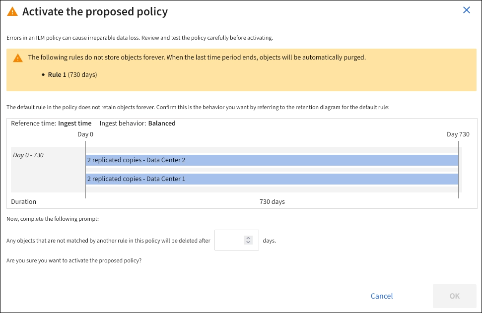

= Aktivieren Sie die ILM-Richtlinie
:allow-uri-read: 
:icons: font
:imagesdir: ../media/

[role="lead"]
Wenn Sie einer vorgeschlagenen ILM-Richtlinie ILM-Regeln hinzufügen, die Richtlinie simulieren und bestätigen, dass es sich wie erwartet verhält, sind Sie bereit, die vorgeschlagene Richtlinie zu aktivieren.

.Bevor Sie beginnen
* Sie sind mit einem bei Grid Manager angemeldet link:../admin/web-browser-requirements.html["Unterstützter Webbrowser"].
* Das ist schon link:../admin/admin-group-permissions.html["Bestimmte Zugriffsberechtigungen"].
* Sie haben die vorgeschlagene ILM-Richtlinie gespeichert und simuliert.

CAUTION: Fehler in einer ILM-Richtlinie können zu nicht wiederherstellbaren Datenverlusten führen. Prüfen und simulieren Sie die Richtlinie sorgfältig, bevor Sie sie aktivieren, um sicherzustellen, dass sie wie vorgesehen funktioniert. + Wenn Sie eine neue ILM-Richtlinie aktivieren, verwendet StorageGRID sie für die Verwaltung aller Objekte, einschließlich vorhandener und neu aufgenommenen Objekte. Prüfen Sie vor der Aktivierung einer neuen ILM-Richtlinie alle Änderungen an der Platzierung vorhandener replizierter und Erasure Coding-Objekte. Das Ändern des Speicherorts eines vorhandenen Objekts kann zu vorübergehenden Ressourcenproblemen führen, wenn die neuen Platzierungen ausgewertet und implementiert werden.

.Über diese Aufgabe
Wenn Sie eine ILM-Richtlinie aktivieren, verteilt das System die neue Richtlinie auf alle Nodes. Die neue aktive Richtlinie tritt jedoch möglicherweise erst in Kraft, wenn alle Grid-Nodes zur Verfügung stehen, um die neue Richtlinie zu erhalten. In einigen Fällen wartet das System auf die Implementierung einer neuen aktiven Richtlinie, um sicherzustellen, dass Grid-Objekte nicht versehentlich entfernt werden.

* Nehmen Richtlinienänderungen vor, die die Datenredundanz oder Aufbewahrungszeit verbessern, werden diese Änderungen sofort implementiert. Wenn Sie beispielsweise eine neue Richtlinie aktivieren, die eine Regel mit drei Kopien anstelle einer Regel mit zwei Kopien enthält, wird diese Richtlinie sofort implementiert, da sie die Datenredundanz erhöht.
* Bei Richtlinienänderungen, die Datenredundanz oder -Langlebigkeit verringern könnten, werden diese Änderungen erst implementiert, wenn alle Grid-Nodes verfügbar sind. Wenn Sie beispielsweise eine neue Richtlinie aktivieren, die eine Regel mit zwei Kopien anstelle einer Regel mit drei Kopien verwendet, wird die neue Richtlinie auf der Registerkarte „Aktive Richtlinie“ angezeigt. Sie wird jedoch erst wirksam, wenn alle Nodes online und verfügbar sind.

.Schritte
. Wenn Sie bereit sind, eine vorgeschlagene Richtlinie zu aktivieren, wählen Sie *ILM-Richtlinien* > *vorgeschlagene Richtlinie* aus, und wählen Sie dann *Aktivieren* aus.
+
Es wird eine Warnmeldung angezeigt, in der Sie aufgefordert werden, zu bestätigen, dass Sie die vorgeschlagene Richtlinie aktivieren möchten.

+
In der Warnmeldung wird eine Eingabeaufforderung angezeigt, wenn die Standardregel Objekte nicht für immer behält. In diesem Beispiel zeigt das Aufbewahrungsdiagramm, dass die Standardregel Objekte nach 730 Tagen (2 Jahre) löscht. Sie müssen *730* in das Textfeld eingeben, um zu bestätigen, dass alle Objekte, die nicht mit einer anderen Regel in der Richtlinie übereinstimmen, nach 730 Tagen aus StorageGRID entfernt werden.

+

. Wählen Sie *OK*.

.Ergebnis
Wenn eine neue ILM-Richtlinie aktiviert wurde:

* Die Richtlinie wird auf der Registerkarte Aktive Richtlinie angezeigt. Der Eintrag Startdatum zeigt das Datum und die Uhrzeit an, zu der die Richtlinie aktiviert wurde.
* Die zuvor aktive Richtlinie wird auf der Registerkarte Richtlinienverlauf angezeigt. Die Einträge für das Start- und Enddatum geben an, wann die Richtlinie aktiv wurde und wann sie nicht mehr in Kraft war.

.Verwandte Informationen
link:example-6-changing-ilm-policy.html["Beispiel 6: Ändern einer ILM-Richtlinie"]
