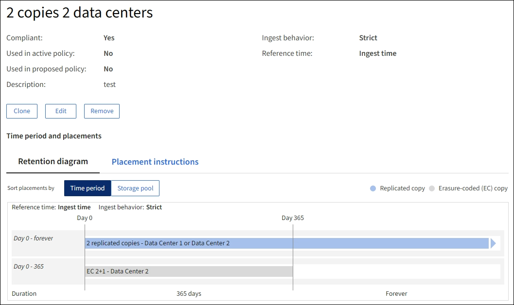
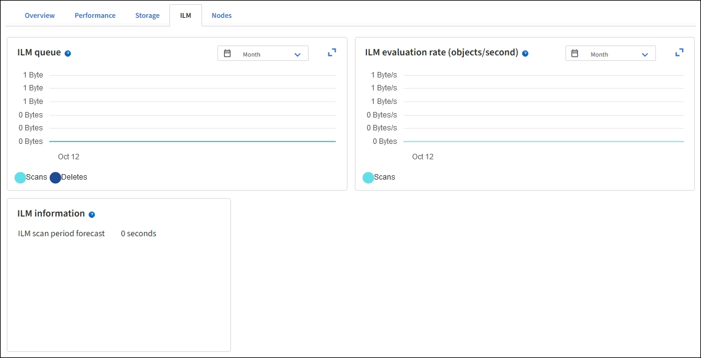

= Arbeiten mit ILM-Richtlinien und ILM-Regeln
:allow-uri-read: 
:icons: font
:imagesdir: ../media/

[role="lead"]
Wenn sich Ihre Speicheranforderungen ändern, müssen Sie möglicherweise eine andere Richtlinie implementieren oder die mit dieser Richtlinie verbundenen ILM-Regeln ändern. Sie können ILM-Metriken anzeigen, um die Systemperformance zu ermitteln.

.Bevor Sie beginnen
* Sie sind mit einem bei Grid Manager angemeldet link:../admin/web-browser-requirements.html["Unterstützter Webbrowser"].
* Sie haben spezifische Zugriffsberechtigungen.

== ILM-Richtlinien anzeigen

So zeigen Sie aktive, vorgeschlagene und historische ILM-Richtlinien an:

. Wählen Sie *ILM* > *Richtlinien*.
. Wählen Sie je nach Bedarf *Aktive Richtlinie*, *vorgeschlagene Richtlinie* oder *Richtlinienverlauf* aus, um die Details zu den einzelnen Richtlinien anzuzeigen. Auf jeder Registerkarte können Sie *Policy rules* und *Retention diagram* auswählen.

image::../media/ilm_policy_active_proposed_history_tabs.png[ILM-Richtlinien-Registerkarten]

== Klonen einer historischen ILM-Richtlinie

So klonen Sie eine historische ILM-Richtlinie:

. Wählen Sie *ILM* > *Richtlinien* > *Richtlinienverlauf* aus.
. Entfernen Sie die vorgeschlagene Richtlinie, falls vorhanden.
. Aktivieren Sie das Optionsfeld für die Richtlinie, die Sie klonen möchten, und wählen Sie dann *historische Richtlinie klonen* aus.
. Füllen Sie die erforderlichen Angaben aus, indem Sie den Anweisungen unter folgen link:creating-proposed-ilm-policy.html["Vorgeschlagene ILM-Richtlinie erstellen"].

CAUTION: Eine falsch konfigurierte ILM-Richtlinie kann zu nicht wiederherstellbaren Datenverlusten führen. Prüfen Sie vor der Aktivierung einer ILM-Richtlinie die ILM-Richtlinie und ihre ILM-Regeln sorgfältig und simulieren Sie anschließend die ILM-Richtlinie. Vergewissern Sie sich immer, dass die ILM-Richtlinie wie vorgesehen funktioniert.

== Entfernen Sie die vorgeschlagene ILM-Richtlinie

So entfernen Sie die vorgeschlagene Richtlinie:

. Wählen Sie *ILM* > *Richtlinien* > *vorgeschlagene Richtlinie* aus.
. Wählen Sie *Aktionen* > *Entfernen*.

Die vorgeschlagene Richtlinie und die vorgeschlagene Policy-Registerkarte werden entfernt.

== Zeigen Sie Einzelheiten zur ILM-Regel an

So zeigen Sie die Details für eine ILM-Regel an, einschließlich des Aufbewahrungsdiagramms und der Anweisungen zur Platzierung der Regel:

. Wählen Sie *ILM* > *Regeln*.
. Wählen Sie die Regel aus, deren Details Sie anzeigen möchten. Beispiel:
+

Darüber hinaus können Sie auf der Detailseite eine Regel klonen, bearbeiten oder entfernen.

== Klonen einer ILM-Regel

Sie können eine Regel nicht bearbeiten, wenn sie in der vorgeschlagenen ILM-Richtlinie oder der aktiven ILM-Richtlinie verwendet wird. Stattdessen können Sie eine Regel klonen und alle erforderlichen Änderungen an der geklonten Kopie vornehmen. Anschließend können Sie die ursprüngliche Regel bei Bedarf aus der vorgeschlagenen Richtlinie entfernen und durch die geänderte Version ersetzen. Sie können eine ILM-Regel nicht klonen, wenn sie mit StorageGRID Version 10.2 oder früher erstellt wurde.

Bevor Sie einer aktiven ILM-Richtlinie eine geklonte Regel hinzufügen, sollten Sie beachten, dass eine Änderung der Anweisungen zur Platzierung eines Objekts zu einer erhöhten Systemauslastung führen kann.

.Schritte
. Wählen Sie *ILM* > *Regeln*.
. Aktivieren Sie das Kontrollkästchen für die Regel, die Sie klonen möchten, und wählen Sie dann *Clone* aus. Alternativ wählen Sie den Regelnamen aus, und wählen Sie dann auf der Seite mit den Regeldetails *Clone* aus.
. Aktualisieren Sie die geklonte Regel, indem Sie die Schritte für befolgen <<Bearbeiten einer ILM-Regel,Bearbeiten einer ILM-Regel>> Und link:create-ilm-rule-enter-details.html#use-advanced-filters-in-ilm-rules["Verwenden erweiterter Filter in ILM-Regeln"].
+
Beim Klonen einer ILM-Regel müssen Sie einen neuen Namen eingeben.

== Bearbeiten einer ILM-Regel

Möglicherweise müssen Sie eine ILM-Regel bearbeiten, um einen Filter oder eine Platzierungsanweisung zu ändern.

Sie können eine Regel nicht bearbeiten, wenn sie in der aktiven ILM-Richtlinie oder der vorgeschlagenen ILM-Richtlinie verwendet wird. Stattdessen können Sie diese Regeln klonen und erforderliche Änderungen an der geklonten Kopie vornehmen. Sie können auch die vom System bereitgestellte Regel nicht bearbeiten, erstellen Sie 2 Kopien.

NOTE: Bevor Sie einer aktiven ILM-Richtlinie eine bearbeitete Regel hinzufügen, müssen Sie beachten, dass eine Änderung der Anweisungen zur Platzierung eines Objekts zu einer erhöhten Systemauslastung führen kann.

.Schritte
. Wählen Sie *ILM* > *Regeln*.
. Bestätigen Sie, dass die zu bearbeitende Regel nicht in der aktiven ILM-Richtlinie oder der vorgeschlagenen ILM-Richtlinie verwendet wird.
. Wenn die Regel, die Sie bearbeiten möchten, nicht verwendet wird, aktivieren Sie das Kontrollkästchen für die Regel und wählen Sie *Aktionen* > *Bearbeiten*. Alternativ wählen Sie den Namen der Regel aus, und wählen Sie dann auf der Seite mit den Regeldetails *Bearbeiten* aus.
. Füllen Sie die Seiten des Assistenten zum Bearbeiten von ILM-Regeln aus. Befolgen Sie bei Bedarf die Schritte für link:create-ilm-rule-enter-details.html["Erstellen einer ILM-Regel"] Und link:create-ilm-rule-enter-details.html#use-advanced-filters-in-ilm-rules["Verwenden erweiterter Filter in ILM-Regeln"].
+
Beim Bearbeiten einer ILM-Regel können Sie ihren Namen nicht ändern.

+

NOTE: Wenn Sie eine Regel bearbeiten, die in einer historischen Richtlinie verwendet wird, wird die image:../media/icon_ilm_rule_historical.png["Verlauf der Symbol-ILM-Regel"] Wenn Sie die Richtlinie anzeigen, wird das Symbol für die Regel angezeigt. Dies bedeutet, dass die Regel zu einer historischen Regel geworden ist.

== Entfernen einer ILM-Regel

Um die Liste der aktuellen ILM-Regeln kontrollierbar zu halten, entfernen Sie alle ILM-Regeln, die Sie wahrscheinlich nicht verwenden werden.

.Schritte
So entfernen Sie eine ILM-Regel, die derzeit in der aktiven Richtlinie oder in der vorgeschlagenen Richtlinie verwendet wird:

. Klonen Sie die aktive Richtlinie, oder bearbeiten Sie die vorgeschlagene Richtlinie.
. Entfernen Sie die ILM-Regel aus der Richtlinie.
. Speichern, simulieren und aktivieren Sie die neue Richtlinie, um sicherzustellen, dass Objekte wie erwartet geschützt sind.

So entfernen Sie eine derzeit nicht verwendete ILM-Regel:

. Wählen Sie *ILM* > *Regeln*.
. Bestätigen Sie, dass die Regel, die Sie entfernen möchten, nicht in der aktiven Richtlinie oder der vorgeschlagenen Richtlinie verwendet wird.
. Wenn die Regel, die Sie entfernen möchten, nicht verwendet wird, wählen Sie die Regel aus und wählen Sie *Entfernen*. Sie können mehrere Regeln auswählen und alle gleichzeitig entfernen.
. Wählen Sie *Yes*, um zu bestätigen, dass Sie die ILM-Regel entfernen möchten.
+
Die ILM-Regel wird entfernt.

+

NOTE: Wenn Sie eine Regel entfernen, die in einer historischen Richtlinie verwendet wird, wird die image:../media/icon_ilm_rule_historical.png["Verlauf der Symbol-ILM-Regel"] Wenn Sie die Richtlinie anzeigen, wird das Symbol für die Regel angezeigt. Dies bedeutet, dass die Regel zu einer historischen Regel geworden ist.

== Anzeigen von ILM-Metriken

Sie können Metriken für ILM anzeigen, z. B. die Anzahl der Objekte in der Warteschlange und die Evaluierungsrate. Sie können diese Kennzahlen überwachen, um die Systemperformance zu ermitteln. Eine große Warteschlange oder Evaluierungsrate zeigt möglicherweise an, dass das System nicht mit der Aufnahmerate Schritt halten kann, die Auslastung der Client-Applikationen zu hoch ist oder dass ein ungewöhnlicher Zustand vorliegt.

.Schritte
. Wählen Sie *Dashboard* > *ILM*.
+

NOTE: Da das Dashboard angepasst werden kann, ist die Registerkarte ILM möglicherweise nicht verfügbar.

. Überwachen Sie die Kennzahlen auf der Registerkarte ILM.
+
Sie können das Fragezeichen auswählen image:../media/icon_nms_question.png["Fragezeichen-Symbol"] Um eine Beschreibung der Elemente auf der Registerkarte ILM anzuzeigen.

+

