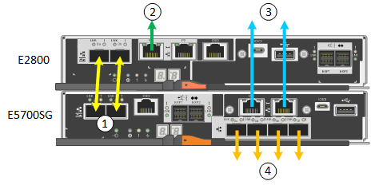

= Kabel-Appliance (SG5700)
:allow-uri-read: 
:icons: font
:imagesdir: ../media/

[role="lead"]
Sie verbinden die beiden Controller miteinander, verbinden die Management-Ports auf jedem Controller und verbinden die 10/25-GbE-Ports des E5700SG Controllers mit dem Grid-Netzwerk und dem optionalen Client-Netzwerk für StorageGRID.

.Bevor Sie beginnen
* Sie haben die folgenden Artikel ausgepackt, die im Lieferumfang des Geräts enthalten sind:
+
** Zwei Netzkabel.
** Zwei optische Kabel für die FC Interconnect-Ports an den Controllern.
** Acht SFP+-Transceiver, die entweder 10 GbE oder 16 Gbit/s FC unterstützen. Die Transceiver können mit den beiden Interconnect Ports auf beiden Controllern und mit den vier 10/25-GbE-Netzwerkports auf dem E5700SG Controller verwendet werden, vorausgesetzt, die Netzwerk-Ports benötigen eine 10-GbE-Verbindungsgeschwindigkeit.

* Sie haben folgende Produkte erhalten, die nicht im Lieferumfang des Geräts enthalten sind:
+
** Ein bis vier optische Kabel für die 10/25-GbE-Ports, die Sie verwenden möchten.
** Ein bis vier SFP28-Transceiver, wenn Sie 25-GbE-Verbindungsgeschwindigkeit verwenden möchten.
** Ethernet-Kabel für die Verbindung der Management-Ports.

CAUTION: *Gefahr der Laserstrahlung* -- keinen Teil eines SFP-Transceivers zerlegen oder entfernen. Sie können Laserstrahlung ausgesetzt sein.

.Über diese Aufgabe
Die Zahlen zeigen die beiden Controller der SG5760 und SG5760X, wobei der Storage Controller der E2800 Serie oben und der E5700SG Controller unten gezeigt werden. In den SG5712 und SG5712X befindet sich der Speicher-Controller der E2800 Serie links vom E5700SG-Controller, wenn er von hinten betrachtet wird.

SG5760-Verbindungen:

SG5760X-Verbindungen:

image::../media/sg5760X_connections.png[Verbindungen auf der SG5760X Appliance]

[cols="1a,2a,2a,2a"]
|===
| Legende | Port | Typ des Ports | Nutzung 

 a| 
1
 a| 
Zwei Interconnect-Ports an jedem Controller
 a| 
16 Gbit/s FC optisch SFP+
 a| 
Verbinden Sie die beiden Controller miteinander.

 a| 
2
 a| 
Management-Port 1 auf dem Controller der E2800 Serie
 a| 
1 GbE (RJ-45)
 a| 
Stellt eine Verbindung mit dem Netzwerk her, in dem Sie auf SANtricity System Manager zugreifen. Sie können das Admin-Netzwerk für StorageGRID oder ein unabhängiges Managementnetzwerk verwenden.

 a| 
2
 a| 
Management-Port 2 auf dem Controller der E2800 Serie
 a| 
1 GbE (RJ-45)
 a| 
Reserviert für technischen Support.

 a| 
3
 a| 
Management-Port 1 am E5700SG Controller
 a| 
1 GbE (RJ-45)
 a| 
Verbindet den E5700SG-Controller mit dem Admin-Netzwerk für StorageGRID.

 a| 
3
 a| 
Management-Port 2 am E5700SG Controller
 a| 
1 GbE (RJ-45)
 a| 
* Kann mit Verwaltungsport 1 verbunden werden, wenn Sie eine redundante Verbindung zum Admin-Netzwerk wünschen.
* Kann unverkabelt und für temporären lokalen Zugang verfügbar sein (IP 169.254.0.1).
* Kann während der Installation verwendet werden, um den E5700SG-Controller mit einem Service-Laptop zu verbinden, wenn DHCP-zugewiesene IP-Adressen nicht verfügbar sind.

 a| 
4
 a| 
10/25-GbE-Ports 1-4 auf dem E5700SG Controller
 a| 
10-GbE oder 25-GbE

*Hinweis:* die im Lieferumfang des Geräts enthaltenen SFP+ Transceiver unterstützen 10-GbE-Verbindungsgeschwindigkeiten. Wenn Sie für die vier Netzwerk-Ports 25-GbE-Verbindungsgeschwindigkeiten verwenden möchten, müssen Sie SFP28-Transceiver bereitstellen.
 a| 
Stellen Sie eine Verbindung zum Grid-Netzwerk und dem Client-Netzwerk für StorageGRID her. Siehe link:port-bond-modes-for-e5700sg-controller-ports.html["Port-Bond-Modi (E5700SG Controller)"].

|===
.Schritte
. Verbinden Sie den E2800 Controller mit dem E5700SG Controller mithilfe von zwei optischen Kabeln und vier der acht SFP+ Transceiver.
+
[cols="1a,1a"]
|===
| Diesen Port verbinden... | Zu diesem Port... 

 a| 
Interconnect-Port 1 auf dem E2800 Controller
 a| 
Interconnect-Port 1 am E5700SG Controller

 a| 
Interconnect-Port 2 auf dem E2800 Controller
 a| 
Interconnect-Port 2 am E5700SG Controller

|===
. Wenn Sie planen, SANtricity System Manager zu verwenden, verbinden Sie Managementport 1 (P1) am E2800 Controller (der RJ-45 Port auf der linken Seite) mit dem Managementnetzwerk für SANtricity System Manager. Verwenden Sie dazu ein Ethernetkabel.
+
Verwenden Sie den Management-Port 2 (P2) nicht auf dem E2800 Controller (der RJ-45-Port auf der rechten Seite). Dieser Port ist für technischen Support reserviert.

. Wenn Sie das Admin-Netzwerk für StorageGRID verwenden möchten, verbinden Sie den Verwaltungsport 1 des E5700SG-Controllers (der RJ-45-Port links) über ein Ethernet-Kabel mit dem Admin-Netzwerk.
+
Wenn Sie den Active-Backup-Netzwerk-Bond-Modus für das Admin-Netzwerk verwenden möchten, verbinden Sie den Management-Port 2 des E5700SG-Controllers (der RJ-45-Port rechts) über ein Ethernet-Kabel mit dem Admin-Netzwerk.

. Verbinden Sie die 10/25-GbE-Ports des E5700SG Controllers mit den entsprechenden Netzwerk-Switches über optische Kabel und SFP+ oder SFP28-Transceiver.
+

NOTE: Alle Ports müssen dieselbe Verbindungsgeschwindigkeit verwenden. Installieren Sie SFP+-Transceiver, wenn Sie 10-GbE-Verbindungsgeschwindigkeiten verwenden möchten. Installieren Sie SFP28 Transceiver, wenn Sie 25-GbE-Linkgeschwindigkeiten verwenden möchten.

+
** Wenn Sie den Modus Fixed Port Bond verwenden möchten (Standard), verbinden Sie die Ports mit dem StorageGRID-Grid und den Client-Netzwerken, wie in der Tabelle dargestellt.
+
[cols="1a,1a"]
|===
| Port | Verbindung wird hergestellt mit... 

 a| 
Port 1
 a| 
Client-Netzwerk (optional)

 a| 
Port 2
 a| 
Grid-Netzwerk

 a| 
Port 3
 a| 
Client-Netzwerk (optional)

 a| 
Port 4
 a| 
Grid-Netzwerk

|===
** Wenn Sie den aggregierten Port Bond-Modus verwenden möchten, verbinden Sie einen oder mehrere Netzwerkports mit einem oder mehreren Switches. Sie sollten mindestens zwei der vier Ports verbinden, um einen Single Point of Failure zu vermeiden. Wenn Sie mehrere Switches für eine einzelne LACP-Verbindung verwenden, müssen die Switches MLAG oder Äquivalent unterstützen.

.Verwandte Informationen
link:accessing-storagegrid-appliance-installer.html["Rufen Sie das Installationsprogramm für StorageGRID-Appliances auf"]
