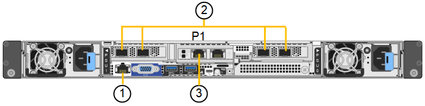

= Kabelgerät (SGF6112)
:allow-uri-read: 
:icons: font
:imagesdir: ../media/

[role="lead"]
Sie verbinden den Management-Port der Appliance mit dem Service-Laptop und verbinden die Netzwerkports der Appliance mit dem Grid-Netzwerk und dem optionalen Client-Netzwerk für StorageGRID.

.Bevor Sie beginnen
* Sie verfügen über ein RJ-45-Ethernet-Kabel zum Anschließen des Management-Ports.
* Sie haben eine der folgenden Optionen für die Netzwerkanschlüsse. Diese Gegenstände sind nicht im Lieferumfang des Geräts enthalten.
+
** Ein bis vier Twinax-Kabel zum Anschließen der vier Netzwerk-Ports.
** Ein bis vier SFP+ oder SFP28 Transceiver, wenn Sie optische Kabel für die Ports verwenden möchten.

CAUTION: *Gefahr der Laserstrahlung* -- keinen Teil eines SFP-Transceivers zerlegen oder entfernen. Sie können Laserstrahlung ausgesetzt sein.

.Über diese Aufgabe
Die folgenden Abbildungen zeigen die Ports auf der Rückseite des SGF6112.

[cols="1a,2a,2a,3a"]
|===
| Legende | Port | Typ des Ports | Nutzung 

 a| 
1
 a| 
BMC-Management-Port auf der Appliance
 a| 
1 GbE (RJ-45)
 a| 
Stellt eine Verbindung zum Netzwerk her, in dem Sie auf die BMC-Schnittstelle zugreifen.

 a| 
2
 a| 
Vier 10/25-GbE-Netzwerkports auf der Appliance
 a| 
 a| 
Stellen Sie eine Verbindung zum Grid-Netzwerk und dem Client-Netzwerk für StorageGRID her.

 a| 
3
 a| 
Admin-Netzwerk-Port auf der Appliance (in der Abbildung mit „P1“ gekennzeichnet)
 a| 
1 GbE (RJ-45)

*Wichtig:* dieser Port arbeitet nur mit 1/10-GbE (RJ-45) und unterstützt keine 100-Megabit-Geschwindigkeiten.
 a| 
Verbindet die Appliance mit dem Admin-Netzwerk für StorageGRID.

 a| 
 a| 
Rechtmäßiger RJ-45-Anschluss am Gerät
 a| 
1 GbE (RJ-45)

*Wichtig:* dieser Port arbeitet nur mit 1/10-GbE (RJ-45) und unterstützt keine 100-Megabit-Geschwindigkeiten.
 a| 
* Kann mit Verwaltungsport 1 verbunden werden, wenn Sie eine redundante Verbindung zum Admin-Netzwerk wünschen.
* Kann getrennt bleiben und für einen temporären lokalen Zugang verfügbar sein (IP 169.254.0.1).
* Während der Installation kann verwendet werden, um das Gerät an einen Service-Laptop anzuschließen, wenn DHCP-zugewiesene IP-Adressen nicht verfügbar sind.

|===
.Schritte
. Schließen Sie den BMC-Managementport der Appliance über ein Ethernet-Kabel an das Managementnetzwerk an.
+
Obwohl diese Verbindung optional ist, wird empfohlen, den Support zu erleichtern.

. Verbinden Sie die Netzwerk-Ports des Geräts mit den entsprechenden Netzwerk-Switches über Twinax-Kabel oder optische Kabel und Transceiver.
+
[NOTE]
====
Alle vier Netzwerkports müssen dieselbe Verbindungsgeschwindigkeit verwenden.

[cols="2a,2a"]
|===
| SGF6112-Verbindungsgeschwindigkeit (GbE) | Erforderliche Ausrüstung 

 a| 
10
 a| 
SFP+-Transceiver

 a| 
25
 a| 
SFP28-Transceiver

|===
====
+
** Wenn Sie den Modus Fixed Port Bond verwenden möchten (Standard), verbinden Sie die Ports mit dem StorageGRID-Grid und den Client-Netzwerken, wie in der Tabelle dargestellt.
+
[cols="1a,2a"]
|===
| Port | Verbindung wird hergestellt mit... 

 a| 
Port 1
 a| 
Client-Netzwerk (optional)

 a| 
Port 2
 a| 
Grid-Netzwerk

 a| 
Port 3
 a| 
Client-Netzwerk (optional)

 a| 
Port 4
 a| 
Grid-Netzwerk

|===
** Wenn Sie den aggregierten Port Bond-Modus verwenden möchten, verbinden Sie einen oder mehrere Netzwerkports mit einem oder mehreren Switches. Sie sollten mindestens zwei der vier Ports verbinden, um einen Single Point of Failure zu vermeiden. Wenn Sie mehrere Switches für eine einzelne LACP-Verbindung verwenden, müssen die Switches MLAG oder Äquivalent unterstützen.

. Wenn Sie das Admin-Netzwerk für StorageGRID verwenden möchten, schließen Sie den Admin-Netzwerkport des Geräts über ein Ethernet-Kabel an das Admin-Netzwerk an.

