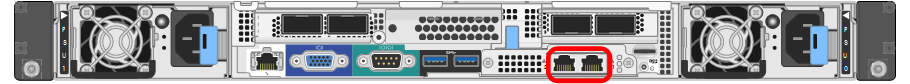

= Erfassen von Installationsinformationen (SG100 und SG1000)
:allow-uri-read: 
:icons: font
:imagesdir: ../media/

[role="lead"]
Notieren Sie die erforderlichen Informationen für jedes Netzwerk, das Sie mit dem Gerät verbinden, in den Tabellen. Diese Werte sind für die Installation und Konfiguration der Hardware erforderlich.

TIP: Verwenden Sie anstelle der Tabellen das mit ConfigBuilder bereitgestellte Arbeitsbuch. Mit der Arbeitsmappe „ConfigBuilder“ können Sie Ihre Systeminformationen hochladen und eine JSON-Datei erstellen, um einige Konfigurationsschritte im Installationsprogramm für StorageGRID-Appliances automatisch auszuführen. Siehe link:automating-appliance-installation-and-configuration.html["Automatisierung der Appliance-Installation und -Konfiguration"].

== Überprüfen Sie die StorageGRID-Version

Vergewissern Sie sich vor der Installation einer SG100- oder SG1000-Service-Appliance, dass Ihr StorageGRID-System eine erforderliche Version der StorageGRID-Software verwendet.

[cols="1a,2a"]
|===
| Appliance | Erforderliche StorageGRID Version 

 a| 
SG1000
 a| 
11.3 oder höher (letzter Hotfix empfohlen)

 a| 
SG100
 a| 
11.4 oder höher (letzter Hotfix empfohlen)

|===

== Administrations- und Wartungs-Ports

Das Admin-Netzwerk für StorageGRID ist ein optionales Netzwerk, das zur Systemadministration und -Wartung verwendet wird. Die Appliance stellt über die folgenden 1-GbE-Management-Ports auf der Appliance eine Verbindung zum Admin-Netzwerk her.

SG100 RJ-45-Ports:

image::../media/sg100_rj_45_ports_circled.png[SG100 RJ-45-Ports]

SG1000 RJ-45-Ports:

[cols="2a,1a"]
|===
| Erforderliche Informationen | Ihr Wert 

 a| 
Admin-Netzwerk aktiviert
 a| 
Bitte auswählen:

* Nein
* Ja (Standard)

 a| 
Netzwerk-Bond-Modus
 a| 
Bitte auswählen:

* Unabhängig (Standard)
* Aktiv/Backup

 a| 
Switch-Port für den im Diagramm eingekreisten linken Port (Standard-aktiver Port für unabhängigen Netzwerk-Bond-Modus)
 a| 

 a| 
Switch-Port für den rechten Port im Diagramm eingekreist (nur aktiv-Backup-Netzwerk-Bond-Modus)
 a| 

 a| 
MAC-Adresse für den Netzwerkport Admin

*Hinweis:* das MAC-Adressenetikett auf der Vorderseite des Geräts listet die MAC-Adresse für den BMC-Verwaltungsport auf. Um die MAC-Adresse für den Admin-Netzwerk-Port zu ermitteln, fügen Sie *2* zur Hexadezimalzahl auf dem Etikett hinzu. Wenn die MAC-Adresse auf dem Etikett beispielsweise mit *09* endet, endet die MAC-Adresse für den Admin-Port in *0B*. Wenn die MAC-Adresse auf dem Etikett mit *(_y_)FF* endet, endet die MAC-Adresse für den Admin-Port in *(_y_+1)01*. Sie können diese Berechnung einfach durchführen, indem Sie den Rechner unter Windows öffnen, ihn auf den Programmiermodus setzen, Hex auswählen, die MAC-Adresse eingeben und dann *+ 2 =* eingeben.
 a| 

 a| 
DHCP-zugewiesene IP-Adresse für den Admin-Netzwerkport, sofern nach dem Einschalten verfügbar

*Hinweis:* Sie können die IP-Adresse ermitteln, die über DHCP zugewiesen wurde, indem Sie die MAC-Adresse verwenden, um die zugewiesene IP zu ermitteln.
 a| 
* IPv4-Adresse (CIDR):
* Gateway:

 a| 
Statische IP-Adresse, die Sie für den Appliance-Knoten im Admin-Netzwerk verwenden möchten

*Hinweis:* Wenn Ihr Netzwerk kein Gateway hat, geben Sie die gleiche statische IPv4-Adresse für das Gateway an.
 a| 
* IPv4-Adresse (CIDR):
* Gateway:

 a| 
Admin-Netzwerk-Subnetze (CIDR)
 a| 

|===

== Netzwerkports

Die vier Netzwerkports auf der Appliance werden mit dem StorageGRID-Grid-Netzwerk und dem optionalen Client-Netzwerk verbunden.

[cols="2a,1a"]
|===
| Erforderliche Informationen | Ihr Wert 

 a| 
Verbindungsgeschwindigkeit
 a| 
Wählen Sie für das SG100 eine der folgenden Optionen aus:

* Auto (Standard)
* 10 GBitE
* 25 GBitE

Wählen Sie für den SG1000 eine der folgenden Optionen aus:

* Auto (Standard)
* 10 GBitE
* 25 GBitE
* 40 GBitE
* 100 GBitE

*Hinweis:* für die SG1000-, 10- und 25-GbE-Geschwindigkeiten sind QSA-Adapter erforderlich.

 a| 
Port Bond-Modus
 a| 
Bitte auswählen:

* Fest (Standard)
* Aggregat

 a| 
Switch-Port für Port 1 (Client-Netzwerk für festen Modus)
 a| 

 a| 
Switch-Port für Port 2 (Grid-Netzwerk für Fixed-Modus)
 a| 

 a| 
Switch-Port für Port 3 (Client-Netzwerk für festen Modus)
 a| 

 a| 
Switch-Port für Port 4 (Grid-Netzwerk für Fixed-Modus)
 a| 

|===

== Grid-Netzwerkports

Das Grid-Netzwerk für StorageGRID ist ein erforderliches Netzwerk, das für den gesamten internen StorageGRID-Datenverkehr verwendet wird. Die Appliance wird über die vier Netzwerk-Ports mit dem Grid-Netzwerk verbunden.

[cols="2a,1a"]
|===
| Erforderliche Informationen | Ihr Wert 

 a| 
Netzwerk-Bond-Modus
 a| 
Bitte auswählen:

* Aktiv/Backup (Standard)
* LACP (802.3ad)

 a| 
VLAN-Tagging aktiviert
 a| 
Bitte auswählen:

* Nein (Standard)
* Ja.

 a| 
VLAN-Tag (bei aktiviertem VLAN-Tagging)
 a| 
Geben Sie einen Wert zwischen 0 und 4095 ein:

 a| 
DHCP-zugewiesene IP-Adresse für das Grid-Netzwerk, sofern nach dem Einschalten verfügbar
 a| 
* IPv4-Adresse (CIDR):
* Gateway:

 a| 
Statische IP-Adresse, die Sie für den Appliance-Node im Grid-Netzwerk verwenden möchten

*Hinweis:* Wenn Ihr Netzwerk kein Gateway hat, geben Sie die gleiche statische IPv4-Adresse für das Gateway an.
 a| 
* IPv4-Adresse (CIDR):
* Gateway:

 a| 
Grid-Netzwerknetze (CIDRs)
 a| 

 a| 
Einstellung für maximale Übertragungseinheit (MTU) (optional) Sie können den Standardwert von 1500 verwenden oder die MTU auf einen Wert setzen, der für Jumbo-Frames geeignet ist, z. B. 9000.
 a| 

|===

== Client-Netzwerkports

Das Client-Netzwerk für StorageGRID ist ein optionales Netzwerk, das in der Regel für den Zugriff auf das Grid auf das Clientprotokoll verwendet wird. Die Appliance wird über die vier Netzwerk-Ports mit dem Client-Netzwerk verbunden.

[cols="2a,1a"]
|===
| Erforderliche Informationen | Ihr Wert 

 a| 
Client-Netzwerk aktiviert
 a| 
Bitte auswählen:

* Nein (Standard)
* Ja.

 a| 
Netzwerk-Bond-Modus
 a| 
Bitte auswählen:

* Aktiv/Backup (Standard)
* LACP (802.3ad)

 a| 
VLAN-Tagging aktiviert
 a| 
Bitte auswählen:

* Nein (Standard)
* Ja.

 a| 
VLAN-Tag (wenn VLAN-Tagging aktiviert ist)
 a| 
Geben Sie einen Wert zwischen 0 und 4095 ein:

 a| 
DHCP-zugewiesene IP-Adresse für das Client-Netzwerk, falls nach dem Einschalten verfügbar
 a| 
* IPv4-Adresse (CIDR):
* Gateway:

 a| 
Statische IP-Adresse, die Sie für den Appliance-Knoten im Client-Netzwerk verwenden möchten

*Hinweis:* Wenn das Client-Netzwerk aktiviert ist, verwendet die Standardroute auf dem Gerät das hier angegebene Gateway.
 a| 
* IPv4-Adresse (CIDR):
* Gateway:

|===

== BMC-Management-Netzwerk-Ports

Sie können über den in der Abbildung eingekreisten 1-GbE-Managementport auf die BMC-Schnittstelle auf der Services-Appliance zugreifen. Dieser Port unterstützt die Remote-Verwaltung der Controller-Hardware über Ethernet unter Verwendung des IPMI-Standards (Intelligent Platform Management Interface).

NOTE: Sie können den Remote-IPMI-Zugriff für alle Appliances aktivieren oder deaktivieren, die einen BMC enthalten, indem Sie den privaten Endpunkt der Management-API VERWENDEN, PUT /private/bmc.

BMC-Management-Port SG100:

image::../media/sg100_bmc_management_port.png[SG100-Management-Port]

SG1000 BMC-Management-Port:

image::../media/sg1000_bmc_management_port.png[SG1000 BMC-Management-Port]

[cols="2a,1a"]
|===
| Erforderliche Informationen | Ihr Wert 

 a| 
Ethernet-Switch-Port Sie stellen eine Verbindung zum BMC-Management-Port her (im Diagramm eingekreist).
 a| 

 a| 
DHCP-zugewiesene IP-Adresse für das BMC-Managementnetzwerk, sofern nach dem Einschalten verfügbar
 a| 
* IPv4-Adresse (CIDR):
* Gateway:

 a| 
Statische IP-Adresse, die Sie für den BMC-Verwaltungsport verwenden möchten
 a| 
* IPv4-Adresse (CIDR):
* Gateway:

|===
.Verwandte Informationen
* link:cabling-appliance-sg100-and-sg1000.html["Kabelgerät (SG100 und SG1000)"]
* link:setting-ip-configuration.html["Konfigurieren Sie StorageGRID-IP-Adressen"]

