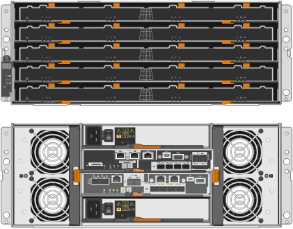

= SG5700 Appliance: Überblick
:allow-uri-read: 
:icons: font
:imagesdir: ../media/

[role="lead"]
Die SG5700 StorageGRID Appliance ist eine integrierte Storage- und Computing-Plattform, die als Storage-Node in einem StorageGRID Grid ausgeführt wird. Die Appliance kann in einer hybriden Grid-Umgebung verwendet werden, die Appliance Storage Nodes und virtuelle (softwarebasierte) Storage-Nodes kombiniert.

Die Appliance der StorageGRID SG5700 Serie bietet folgende Funktionen:

* Integrieren Sie die Storage- und Computing-Elemente für einen StorageGRID Storage Node.
* Schließen Sie das Installationsprogramm für StorageGRID Appliance an, um die Implementierung und Konfiguration von Storage-Nodes zu vereinfachen.
* Umfasst E-Series SANtricity System Manager für Hardware-Management und Monitoring.
* Unterstützung für bis zu vier 10-GbE- oder 25-GbE-Verbindungen mit dem StorageGRID-Grid-Netzwerk und dem Client-Netzwerk.
* Unterstützung für Full Disk Encryption (FDE)-Laufwerke oder FIPS-Laufwerke Wenn diese Laufwerke mit der Laufwerksicherheitsfunktion in SANtricity System Manager verwendet werden, wird ein nicht autorisierter Zugriff auf die Daten verhindert.

Das SG5700-Appliance ist in vier Modellen verfügbar: SG5712 und SG5712X sowie SG5760 und SG5760. Es gibt keine Spezifikations- oder Funktionsunterschiede zwischen dem SG5712 und SG5712X außer der Lage der Interconnect-Ports auf dem Storage Controller. Ebenso gibt es keine Spezifikations- oder Funktionsunterschiede zwischen dem SG5760 und dem SG5760X, außer dem Standort der Interconnect Ports am Storage Controller.

== SG5700 Komponenten

Die SG5700 Modelle umfassen die folgenden Komponenten:

[cols="1a,1a,1a,1a,1a"]
|===
| Komponente | SG5712 | SG5712X | SG5760 | SG5760 

 a| 
Computing-Controller
 a| 
E5700SG Controller
 a| 
E5700SG Controller
 a| 
E5700SG Controller
 a| 
E5700SG Controller

 a| 
Storage Controller
 a| 
E2800A-Controller
 a| 
E2800B-Controller
 a| 
E2800A-Controller
 a| 
E2800B-Controller

 a| 
Chassis
 a| 
E-Series DE212C-Gehäuse, ein 2-HE-Gehäuse (Rack-Unit)
 a| 
E-Series DE212C-Gehäuse, ein 2-HE-Gehäuse (Rack-Unit)
 a| 
E-Series DE460C Gehäuse, ein 4-HE-Gehäuse (Rack-Unit
 a| 
E-Series DE460C Gehäuse, ein 4-HE-Gehäuse (Rack-Unit

 a| 
Laufwerke
 a| 
12 NL-SAS-Laufwerke (3.5 Zoll)
 a| 
12 NL-SAS-Laufwerke (3.5 Zoll)
 a| 
60 NL-SAS-Laufwerke (3.5 Zoll)
 a| 
60 NL-SAS-Laufwerke (3.5 Zoll)

 a| 
Redundante Netzteile und Lüfter
 a| 
Zwei Power-Fan-Kanister
 a| 
Zwei Power-Fan-Kanister
 a| 
Zwei Leistungskanister und zwei Lüfterkanister
 a| 
Zwei Leistungskanister und zwei Lüfterkanister

|===
Der maximale Rohkapazität, der in der StorageGRID-Appliance verfügbar ist, richtet sich nach der Anzahl der Laufwerke in jedem Gehäuse. Sie können den verfügbaren Speicher nicht erweitern, indem Sie ein Shelf mit zusätzlichen Laufwerken hinzufügen.

== SG5700-Diagramme

=== SG5712 Vorder- und Rückansicht

Die Abbildungen zeigen die Vorder- und Rückseite des SG5712, einem 2-HE-Gehäuse für 12 Laufwerke.

image::../media/sg5712_front_and_back_views.gif[Vorder- und Rückseite des SG5712-Geräts]

=== SG5712 Komponenten

Die SG5712 umfasst zwei Controller und zwei Power-Fan-Kanister.

image::../media/sg5712_with_callouts.gif[Controller und Power-Fan-Behälter im SG5712-Gerät]

[cols="1a,3a"]
|===
| Legende | Beschreibung 

 a| 
1
 a| 
E2800A-Controller (Storage-Controller)

 a| 
2
 a| 
E5700SG Controller (Compute-Controller)

 a| 
3
 a| 
Power-Fan-Behälter

|===

=== SG5712X Vorder- und Rückansicht

Die Abbildungen zeigen die Vorder- und Rückseite des SG5712X, einem 2U-Gehäuse für 12 Laufwerke.

image::../media/sg5712x_front_and_back_views.gif[Vorder- und Rückseite des SG5712X-Geräts]

=== SG5712X Komponenten

Das SG5712X besteht aus zwei Controllern und zwei Power-Fan-Kanistern.

image::../media/sg5712x_with_callouts.gif[Controller und Power-Fan-Behälter im SG5712X-Gerät]

[cols="1a,3a"]
|===
| Legende | Beschreibung 

 a| 
1
 a| 
E2800B-Controller (Storage-Controller)

 a| 
2
 a| 
E5700SG Controller (Compute-Controller)

 a| 
3
 a| 
Power-Fan-Behälter

|===

=== Vorder- und Rückansicht des SG5760

Die Abbildungen zeigen die Vorder- und Rückseite des SG5760-Modells, ein 4-HE-Gehäuse für 60 Laufwerke in 5 Laufwerkseinschüben.

image::../media/sg5760_front_and_back_views.gif[Vorder- und Rückseite des SG5760-Geräts]

=== SG5760 Komponenten

Die SG5760 verfügt über zwei Controller, zwei Lüfterbehälter und zwei Strombehälter.

image::../media/sg5760_with_callouts.gif[Controller,fan canisters,and power canisters in SG5760 appliance]

[cols="1a,2a"]
|===
| Legende | Beschreibung 

 a| 
1
 a| 
E2800A-Controller (Storage-Controller)

 a| 
2
 a| 
E5700SG Controller (Compute-Controller)

 a| 
3
 a| 
Gebläsebehälter (1 von 2)

 a| 
4
 a| 
Leistungsbehälter (1 von 2)

|===

=== SG5760X Vorder- und Rückansicht

Die Abbildungen zeigen die Vorder- und Rückseite des Modells SG5760X, einem 4U-Gehäuse, das 60 Laufwerke in 5 Laufwerkseinschüben aufnehmen kann.

=== SG5760X Komponenten

Die SG5760X enthält zwei Controller, zwei Lüfterzangen und zwei Leistungszangen.

image::../media/sg5760x_with_callouts.gif[Controller,fan canisters,and power canisters in SG5760X appliance]

[cols="1a,3a"]
|===
| Legende | Beschreibung 

 a| 
1
 a| 
E2800B-Controller (Storage-Controller)

 a| 
2
 a| 
E5700SG Controller (Compute-Controller)

 a| 
3
 a| 
Gebläsebehälter (1 von 2)

 a| 
4
 a| 
Leistungsbehälter (1 von 2)

|===
.Verwandte Informationen
http://mysupport.netapp.com/info/web/ECMP1658252.html["NetApp E-Series Systems Documentation Site"^]
