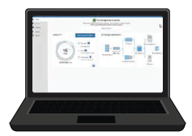

= Beschaffen Sie sich zusätzliche Geräte und Werkzeuge
:allow-uri-read: 
:icons: font
:imagesdir: ../media/

[role="lead"]
Vergewissern Sie sich vor der Installation eines StorageGRID-Geräts, dass Sie über alle zusätzlichen Geräte und Werkzeuge verfügen, die Sie benötigen.

== Alle Geräte

Für die Installation und Konfiguration aller Appliances benötigen Sie die folgenden Geräte:

[cols="1a,4a"]
|===
| Element | Wie es aussieht 

 a| 
Schraubendreher
 a| 
image::../media/screwdrivers.gif[Zwei Schraubendreher]

* Phillips Nr. 2 Schraubendreher
* Mittlerer Schlitzschraubendreher

 a| 
ESD-Handgelenkschlaufe
 a| 
image::../media/appliance_wriststrap.gif[ESD-Handgelenkschlaufe]

 a| 
Service-Laptop
 a| 

* link:web-browser-requirements.html["Unterstützter Webbrowser"]
* SSH-Client, z. B. PuTTY
* 1-GbE-Port (RJ-45

NOTE: Einige Ports unterstützen möglicherweise keine 10/100 Ethernet-Geschwindigkeiten.

 a| 
Optionale Werkzeuge
 a| 
image::../media/optional_tools.gif[Kraftbohrer und Taschenlampe]

* Kraftbohrer mit Kreuzschlitz
* Taschenlampe

|===

== SGF6112

Für die Installation und Konfiguration der SGF6112-Hardware benötigen Sie die folgenden zusätzlichen Geräte.

[cols="1a,4a"]
|===
| Element | Wie es aussieht 

 a| 
Optische Kabel und Transceiver
 a| 
image::../media/fc_cable_and_sfp.gif[Optisches Kabel und QSFP+ Transceiver]

* Ein bis vier dieser Kabeltypen:
+
** Twinax/Kupfer
** Glasfaser/Optisch

* Je ein bis vier dieser Transceiver/Adapter auf Basis der Verbindungsgeschwindigkeit (gemischte Geschwindigkeiten werden nicht unterstützt):
+
** 10-GbE SFP+
** 25-GbE-SFP28

 a| 
RJ-45-Ethernet-Kabel (Cat5/Cat5e/Cat6/Cat6a)
 a| 
image::../media/ethernet_cables.png[Ethernet-Kabel]

|===

== SG6000

Für die Installation und Konfiguration der SG6000-Hardware benötigen Sie die folgenden zusätzlichen Geräte:

[cols="1a,4a"]
|===
| Element | Wie es aussieht 

 a| 
Optische Kabel und SFP-Transceiver
 a| 
image::../media/fc_cable_and_sfp.gif[Optisches Kabel und SFP+ Transceiver]

* Ein bis vier dieser Kabeltypen:
+
** Twinax/Kupfer
** Glasfaser/Optisch

* Je ein bis vier dieser Transceiver/Adapter, basierend auf der Verbindungsgeschwindigkeit (gemischte Geschwindigkeiten werden nicht unterstützt):
+
** 10-GbE SFP+
** 25-GbE-SFP28

 a| 
RJ-45-Ethernet-Kabel (Cat5/Cat5e/Cat6)
 a| 
image::../media/ethernet_cables.png[Ethernet-Kabel]

 a| 
Optionale Werkzeuge
 a| 
Mechanisierter Lift für 60-Laufwerk-Shelfs

|===

== SG5700

Für die Installation und Konfiguration der SG5700-Hardware benötigen Sie die folgenden zusätzlichen Geräte:

[cols="1a,4a"]
|===
| Element | Wie es aussieht 

 a| 
Optische Kabel und SFP-Transceiver
 a| 
image::../media/fc_cable_and_sfp.gif[Optisches Kabel und SFP+ Transceiver]

* Optische Kabel für die 10/25-GbE-Ports, die Sie verwenden möchten
* Optional: SFP28 Transceiver, wenn Sie 25-GbE-Verbindungsgeschwindigkeit verwenden möchten

 a| 
Ethernet-Kabel
 a| 
image::../media/ethernet_cables.png[Ethernet-Kabel]

 a| 
Optionale Werkzeuge
 a| 
Mechanisierter Lift für SG5760

|===

== SG100 und SG1000

Für die Installation und Konfiguration der SG100- und SG1000-Hardware benötigen Sie die folgenden zusätzlichen Geräte.

[cols="1a,4a"]
|===
| Element | Wie es aussieht 

 a| 
Optische Kabel und Transceiver
 a| 
image::../media/fc_cable_and_sfp.gif[Optisches Kabel und QSFP+ Transceiver]

* Ein bis vier dieser Kabeltypen:
+
** Twinax/Kupfer
** Glasfaser/Optisch

* Je ein bis vier dieser Transceiver/Adapter auf Basis der Verbindungsgeschwindigkeit (gemischte Geschwindigkeiten werden nicht unterstützt):
+
** SG100:
+
*** 10-GbE SFP+
*** 25-GbE-SFP28

** SG1000:
+
*** 10-GbE QSFP-to-SFP-Adapter (QSA) und SFP+
*** 25-GbE QSFP-zu-SFP-Adapter (QSA) und SFP28
*** 40-GbE QSFP+
*** 100-GbE-QFSP28

 a| 
RJ-45-Ethernet-Kabel (Cat5/Cat5e/Cat6/Cat6a)
 a| 
image::../media/ethernet_cables.png[Ethernet-Kabel]

|===