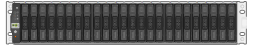

= Packen Sie die Kartons aus
:allow-uri-read: 
:icons: font
:imagesdir: ../media/

[role="lead"]
Packen Sie vor der Installation des StorageGRID-Geräts alle Kartons aus, und vergleichen Sie den Inhalt mit den Artikeln auf dem Packzettel.

== SGF6112 Appliances

=== Trennt

[cols="1a,4a"]
|===
| Element | Wie es aussieht 

 a| 
SGF6112
 a| 
image::../media/sg6000_cn_front_without_bezel.gif[Frontantrieb SGF6112-Gerät]

 a| 
Schienensatz mit Anleitung
 a| 
image::../media/rail_kit.gif[Schienensatz]

 a| 
Frontblende
 a| 
image::../media/sgf_6112_front_bezel.png[Frontblende]

|===

=== Stromkabel

Im Lieferumfang eines SGF6112-Geräts sind die folgenden Netzkabel enthalten:

TIP: Ihr Schrank verfügt möglicherweise über spezielle Netzkabel, die Sie anstelle der Netzkabel verwenden, die Sie zur Einheit mit dem Gerät anschließen.

[cols="1a,4a"]
|===
| Element | Wie es aussieht 

 a| 
Zwei Netzkabel für dein Land
 a| 
image::../media/power_cords.gif[Stromkabel]

|===

== SG6000 Appliances

=== SG6060-Hardware

[cols="1a,4a"]
|===
| Element | Wie es aussieht 

 a| 
SG6000-CN Controller
 a| 
image::../media/sg6000_cn_front_without_bezel.gif[SG6000-CN Controller]

 a| 
E2860 Controller-Shelf ohne installierte Laufwerke
 a| 
image::../media/de460c_table_size.gif[SG5760 4-HE-Appliance]

 a| 
Zwei Frontrahmen
 a| 
image::../media/sg6000_front_bezels_for_table.gif[Vorderrahmen]

 a| 
Zwei Schienensätze mit Anweisungen
 a| 
image::../media/rail_kit.gif[Schienensatz]

 a| 
60 Laufwerke (2 SSD und 58 NL-SAS)
 a| 
image::../media/sg5760_drive.gif[Laufwerk]

 a| 
Vier Griffe
 a| 
image::../media/handles.gif[Das SG5760 verarbeitet]

 a| 
Rückhalterungen und Käfigmuttern für Rack-Montage mit Vierkantloch
 a| 
image::../media/back_brackets_table_size.gif[Rückenhalterungen und Käfigmuttern für SG5760]

|===

=== SG6060 Erweiterungs-Shelf

[cols="1a,4a"]
|===
| Element | Wie es aussieht 

 a| 
Erweiterungs-Shelf ohne Laufwerke installiert
 a| 
image::../media/de460c_table_size.gif[SG5760 4-HE-Appliance]

 a| 
Frontblende
 a| 
image::../media/front_bezel_for_table_de460c.gif[Frontblende DE460C]

 a| 
60 NL-SAS-Laufwerke
 a| 
image::../media/sg5760_drive.gif[Laufwerk]

 a| 
Ein Schienensatz mit Anweisungen
 a| 
image::../media/rail_kit.gif[Schienensatz]

 a| 
Vier Griffe
 a| 
image::../media/handles.gif[Das SG5760 verarbeitet]

 a| 
Rückhalterungen und Käfigmuttern für Rack-Montage mit Vierkantloch
 a| 
image::../media/back_brackets_table_size.gif[Rückenhalterungen und Käfigmuttern für SG5760]

|===

=== SGF6024 Hardware

[cols="1a,4a"]
|===
| Element | Wie es aussieht 

 a| 
SG6000-CN Controller
 a| 
image::../media/sg6000_cn_front_without_bezel.gif[SG6000-CN Controller]

 a| 
EF570 Flash-Array mit 24 installierten Solid State-Laufwerken (Flash
 a| 

 a| 
Zwei Frontrahmen
 a| 
image::../media/sgf6024_front_bezels_for_table.png[SG6024 Vorderrahmen]

 a| 
Zwei Schienensätze mit Anweisungen
 a| 
image::../media/rail_kit.gif[Schienensatz]

 a| 
Endkappen für die Ablage
 a| 
image::../media/endcaps.png[Endkappen]

|===

=== Kabel und Anschlüsse

Im Lieferumfang einer SG6000 Appliance sind die folgenden Kabel und Anschlüsse enthalten.

TIP: Ihr Schrank verfügt möglicherweise über spezielle Netzkabel, die Sie anstelle der Netzkabel verwenden, die Sie zur Einheit mit dem Gerät anschließen.

[cols="1a,4a"]
|===
| Element | Wie es aussieht 

 a| 
Vier Netzkabel für Ihr Land
 a| 
image::../media/power_cords.gif[Stromkabel]

 a| 
Optische Kabel und SFP-Transceiver
 a| 
image::../media/fc_cable_and_sfp.gif[Optische Kabel und SFPs]

* Vier optische Kabel für die FC Interconnect Ports
* Vier SFP+-Transceiver, die 16 Gbit/s FC unterstützen

 a| 
Optional: Zwei SAS-Kabel zum Anschluss jedes SG6060-Erweiterungs-Shelfs
 a| 
image::../media/sas_cable.gif[SAS-Kabel]

|===

== SG5700 Appliances

=== Trennt

[cols="1a,4a"]
|===
| Element | Wie es aussieht 

 a| 
SG5712 Appliance mit installierten 12 Laufwerken
 a| 
image::../media/de212c_table_size.gif[SG5712-2-HE-Appliance]

 a| 
SG5760 Appliance ohne installierte Laufwerke
 a| 
image::../media/de460c_table_size.gif[SG5760 4-HE-Appliance]

 a| 
Frontverkleidung für das Gerät
 a| 
image::../media/sg5700_front_bezels.gif[Bezels der SG5712 und SG5760]

 a| 
Schienensatz mit Anleitung
 a| 
image::../media/rail_kit.gif[Schienensatz]

 a| 
SG5760: Sechzig Laufwerke
 a| 
image::../media/sg5760_drive.gif[Laufwerk]

 a| 
SG5760: Griffe
 a| 
image::../media/handles.gif[Das SG5760 verarbeitet]

 a| 
SG5760: Rückenhalterungen und Käfigmuttern für Rack-Montage mit Vierkantloch
 a| 
image::../media/back_brackets_table_size.gif[Rückenhalterungen und Käfigmuttern für SG5760]

|===

=== Kabel und Anschlüsse

Der Versand für eine SG5700 Appliance umfasst die folgenden Kabel und Anschlüsse.

TIP: Ihr Schrank verfügt möglicherweise über spezielle Netzkabel, die Sie anstelle der Netzkabel verwenden, die Sie zur Einheit mit dem Gerät anschließen.

[cols="1a,4a"]
|===
| Element | Wie es aussieht 

 a| 
Zwei Netzkabel für dein Land
 a| 
image::../media/power_cords.gif[Stromkabel]

 a| 
Optische Kabel und SFP-Transceiver
 a| 
image::../media/fc_cable_and_sfp.gif[Optische Kabel und SFPs]

* Zwei optische Kabel für die FC Interconnect Ports
* Acht SFP+-Transceiver, kompatibel mit den vier 16-Gbit/s-FC-Interconnect-Ports und den vier 10-GbE-Netzwerkports

|===

== SG100 und SG1000 Appliances

=== Trennt

[cols="1a,4a"]
|===
| Element | Wie es aussieht 

 a| 
SG100 oder SG1000
 a| 
image::../media/sg6000_cn_front_without_bezel.gif[Laufwerke SG 100 oder SG1000 Services-Appliance als Front]

 a| 
Schienensatz mit Anleitung
 a| 
image::../media/rail_kit.gif[Schienensatz]

|===

=== Stromkabel

Im Lieferumfang einer SG100 oder SG1000 Appliance sind die folgenden Netzkabel enthalten:

TIP: Ihr Schrank verfügt möglicherweise über spezielle Netzkabel, die Sie anstelle der Netzkabel verwenden, die Sie zur Einheit mit dem Gerät anschließen.

[cols="1a,4a"]
|===
| Element | Wie es aussieht 

 a| 
Zwei Netzkabel für dein Land
 a| 
image::../media/power_cords.gif[Stromkabel]

|===