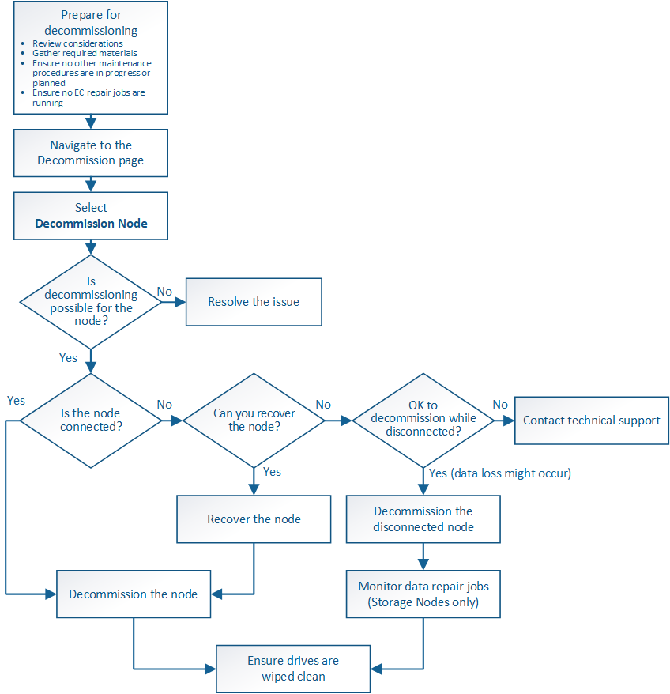

= Deaktivierung von Grid Nodes: Übersicht
:allow-uri-read: 
:icons: font
:imagesdir: ../media/

[role="lead"]
Sie können den Node Decounter-Vorgang verwenden, um einen oder mehrere Storage-Nodes, Gateway-Nodes oder nicht-primäre Admin-Nodes an einem oder mehreren Standorten zu entfernen. Sie können den primären Admin-Node oder einen Archive Node nicht stilllegen.

Im Allgemeinen sollten die Grid-Knoten nur dann außer Betrieb gesetzt werden, wenn sie mit dem StorageGRID-System verbunden sind und alle Knoten im normalen Zustand sind (mit grünen Symbolen auf den *NODES*-Seiten und auf der Seite *Decommission-Knoten*). Bei Bedarf können Sie jedoch einen nicht verbundenen Grid-Node außer Betrieb nehmen. Bevor Sie einen getrennten Knoten entfernen, stellen Sie sicher, dass Sie die Auswirkungen und Einschränkungen dieses Prozesses verstehen.

Wenn einer der folgenden Optionen zutrifft, wird das Verfahren zur Deaktivierung des Nodes ausgeführt:

* Sie haben dem System einen größeren Speicherknoten hinzugefügt, und Sie möchten einen oder mehrere kleinere Speicherknoten entfernen, während gleichzeitig Objekte erhalten bleiben.
* Sie benötigen weniger Storage insgesamt.
* Sie benötigen keinen Gateway-Node mehr.
* Sie benötigen keinen nicht mehr primären Admin-Node.
* Das Raster enthält einen getrennten Knoten, den Sie nicht wiederherstellen oder wieder in den Online-Modus versetzen können.

Das Flussdiagramm zeigt die grundlegenden Schritte zur Deaktivierung von Grid-Nodes.

