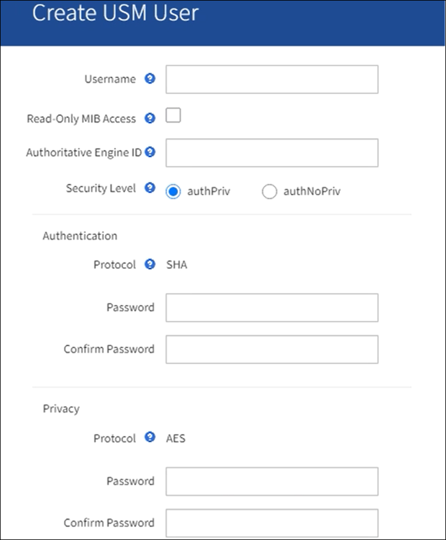
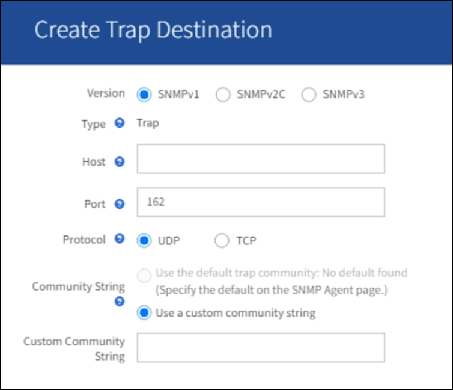

= Konfigurieren Sie den SNMP-Agent
:allow-uri-read: 
:icons: font
:imagesdir: ../media/

[role="lead"]
Sie können den StorageGRID SNMP-Agent konfigurieren, wenn Sie ein Drittanbieter-SNMP-Verwaltungssystem für schreibgeschützten MIB-Zugriff und Benachrichtigungen verwenden möchten.

.Bevor Sie beginnen
* Sie sind mit einem bei Grid Manager angemeldet link:../admin/web-browser-requirements.html["Unterstützter Webbrowser"].
* Sie haben die Root-Zugriffsberechtigung.

.Über diese Aufgabe
Der StorageGRID SNMP Agent unterstützt alle drei Versionen des SNMP-Protokolls. Sie können den Agent für eine oder mehrere Versionen konfigurieren.

.Schritte
. Wählen Sie *KONFIGURATION* > *Überwachung* > *SNMP-Agent*.
+
Die Seite SNMP-Agent wird angezeigt.

+
image::../media/snmp_agent_not_enabled.png[SNMP-Agent nicht aktiviert]

. Um den SNMP-Agent auf allen Grid-Knoten zu aktivieren, aktivieren Sie das Kontrollkästchen *SNMP aktivieren*.
+
Die Felder zum Konfigurieren eines SNMP-Agenten werden angezeigt.

+
image::../media/snmp_agent_page.png[SNMP-Agent-Seite]

. Geben Sie im Feld *Systemkontakt* den Wert ein, den StorageGRID in SNMP-Nachrichten für sysContact bereitstellen soll.
+
Der Systemkontakt ist in der Regel eine E-Mail-Adresse. Der von Ihnen ausliefern Wert gilt für alle Nodes im StorageGRID System. *Systemkontakt* kann maximal 255 Zeichen lang sein.

. Geben Sie im Feld *Systemstandort* den Wert ein, den StorageGRID in SNMP-Nachrichten für sysLocation bereitstellen soll.
+
Der Systemstandort kann alle Informationen sein, die für die Identifizierung des Standortes Ihres StorageGRID-Systems nützlich sind. Sie können beispielsweise die Straßenadresse einer Einrichtung verwenden. Der von Ihnen ausliefern Wert gilt für alle Nodes im StorageGRID System. *Systemposition* kann maximal 255 Zeichen enthalten.

. Lassen Sie das Kontrollkästchen *SNMP-Agentenbenachrichtigungen aktivieren* aktiviert, wenn der StorageGRID SNMP-Agent Trap- und Benachrichtigungen senden soll.
+
Wenn dieses Kontrollkästchen deaktiviert ist, unterstützt der SNMP-Agent schreibgeschützten MIB-Zugriff, sendet jedoch keine SNMP-Benachrichtigungen.

. Aktivieren Sie das Kontrollkästchen *Authentifizierungs-Traps aktivieren*, wenn der StorageGRID-SNMP-Agent einen Authentifizierungs-Trap senden soll, wenn er eine nicht ordnungsgemäß authentifizierte Protokollnachricht erhält.
. Wenn Sie SNMPv1 oder SNMPv2c verwenden, füllen Sie den Abschnitt „Gemeinschaftsfolgen“ aus.
+
Die Felder in diesem Abschnitt werden für die Community-basierte Authentifizierung in SNMPv1 oder SNMPv2c verwendet. Diese Felder gelten nicht für SNMPv3.

+
.. Geben Sie im Feld *Default Trap Community* optional die Standard-Community-Zeichenfolge ein, die Sie für Trap-Ziele verwenden möchten.
+
Bei Bedarf können Sie eine andere („`Custom`")-Community-Zeichenfolge angeben <<select_trap_destination,Definieren Sie ein bestimmtes Trap-Ziel>>.

+
*Default Trap Community* darf maximal 32 Zeichen lang sein und darf keine Leerzeichen enthalten.

.. Geben Sie für *Read-Only Community* eine oder mehrere Community-Strings ein, um schreibgeschützten MIB-Zugriff auf IPv4- und IPv6-Agent-Adressen zu ermöglichen. Wählen Sie das Pluszeichen aus image:../media/icon_plus_sign_black_on_white_old.png["Plus-Zeichen"] Um mehrere Zeichenfolgen hinzuzufügen.
+
Wenn das Verwaltungssystem die StorageGRID-MIB abfragt, sendet es eine Community-Zeichenfolge. Wenn die Community-Zeichenfolge einem der hier angegebenen Werte entspricht, sendet der SNMP-Agent eine Antwort an das Managementsystem.

+
Jede Community-Zeichenfolge darf maximal 32 Zeichen lang sein und darf keine Leerzeichen enthalten. Es sind bis zu fünf Zeichenfolgen zulässig.

+

NOTE: Um die Sicherheit Ihres StorageGRID-Systems zu gewährleisten, verwenden Sie „`public`“ nicht als Community-String. Wenn Sie keine Community-Zeichenfolge eingeben, verwendet der SNMP-Agent die Grid-ID Ihres StorageGRID-Systems als Community-String.

. Wählen Sie optional im Abschnitt andere Konfigurationen die Registerkarte Agentenadressen aus.
+
Verwenden Sie diese Registerkarte, um eine oder mehrere „`Listening-Adressen`“ anzugeben. Dies sind die StorageGRID-Adressen, auf denen der SNMP-Agent Anfragen erhalten kann. Jede Agentenadresse umfasst ein Internetprotokoll, ein Transportprotokoll, ein StorageGRID-Netzwerk und optional einen Port.

+
Wenn Sie keine Agentenadresse konfigurieren, ist die standardmäßige Abhöradresse in allen StorageGRID-Netzwerken UDP-Port 161.

+
.. Wählen Sie *Erstellen*.
+
Das Dialogfeld Agentenadresse erstellen wird angezeigt.

+
image::../media/snmp_create_agent_address.png[SNMP-Agent-Adresse]

.. Wählen Sie für *Internet Protocol* aus, ob diese Adresse IPv4 oder IPv6 verwendet.
+
Standardmäßig verwendet SNMP IPv4.

.. Wählen Sie für *Transport Protocol* aus, ob diese Adresse UDP oder TCP verwenden soll.
+
Standardmäßig verwendet SNMP UDP.

.. Wählen Sie im Feld *StorageGRID-Netzwerk* das StorageGRID-Netzwerk aus, auf dem die Abfrage empfangen wird.
+
*** Grid-, Admin- und Client-Netzwerke: StorageGRID sollte SNMP-Abfragen in allen drei Netzwerken abhören.
*** Grid-Netzwerk
*** Admin-Netzwerk
*** Client-Netzwerk
+

NOTE: Um sicherzustellen, dass die Clientkommunikation mit StorageGRID sicher bleibt, sollten Sie keine Agentenadresse für das Clientnetzwerk erstellen.

.. Geben Sie im Feld *Port* optional die Portnummer ein, die der SNMP-Agent anhören soll.
+
Der Standard-UDP-Port für einen SNMP-Agenten ist 161, Sie können jedoch alle nicht verwendeten Portnummern eingeben.

+

NOTE: Wenn Sie den SNMP-Agent speichern, öffnet StorageGRID automatisch die Agent-Adressen-Ports in der internen Firewall. Sie müssen sicherstellen, dass alle externen Firewalls den Zugriff auf diese Ports zulassen.

.. Wählen Sie *Erstellen*.
+
Die Agentenadresse wird erstellt und der Tabelle hinzugefügt.

+
image::../media/snmp_other_configurations_agent_addresses_table.png[Tabelle mit anderen SNMP-Konfigurationen Agent-Adressen]

. Wenn Sie SNMPv3 verwenden, wählen Sie im Abschnitt Weitere Konfigurationen die Registerkarte USM-Benutzer aus.
+
Über diese Registerkarte können Sie USM-Benutzer definieren, die berechtigt sind, die MIB abzufragen oder Traps zu empfangen und zu informieren.

+

NOTE: Dieser Schritt gilt nicht, wenn Sie nur SNMPv1 oder SNMPv2c verwenden.

+
.. Wählen Sie *Erstellen*.
+
Das Dialogfeld USM-Benutzer erstellen wird angezeigt.

+

.. Geben Sie einen eindeutigen *Benutzername* für diesen USM-Benutzer ein.
+
Benutzernamen dürfen maximal 32 Zeichen enthalten und dürfen keine Leerzeichen enthalten. Der Benutzername kann nach dem Erstellen des Benutzers nicht mehr geändert werden.

.. Aktivieren Sie das Kontrollkästchen *schreibgeschützter MIB-Zugriff*, wenn dieser Benutzer schreibgeschützten Zugriff auf die MIB haben soll.
+
Wenn Sie *schreibgeschütztes MIB Access* auswählen, ist das Feld *autoritative Engine ID* deaktiviert.

+

NOTE: USM-Benutzer mit schreibgeschütztem MIB-Zugriff können keine Engine-IDs haben.

.. Wenn dieser Benutzer in einem Inform-Ziel verwendet wird, geben Sie die *autoritative Engine-ID* für diesen Benutzer ein.
+

NOTE: SNMPv3-Inform-Ziele müssen Benutzer mit Engine-IDs haben. Das SNMPv3-Trap-Ziel kann keine Benutzer mit Engine-IDs haben.

+
Die autoritative Engine-ID kann zwischen 5 und 32 Byte hexadezimal sein.

.. Wählen Sie eine Sicherheitsstufe für den USM-Benutzer aus.
+
*** *AuthPriv*: Dieser Benutzer kommuniziert mit Authentifizierung und Datenschutz (Verschlüsselung). Sie müssen ein Authentifizierungsprotokoll und ein Passwort sowie ein Datenschutzprotokoll und ein Passwort angeben.
*** *AuthNoPriv*: Dieser Benutzer kommuniziert mit Authentifizierung und ohne Datenschutz (keine Verschlüsselung). Sie müssen ein Authentifizierungsprotokoll und ein Passwort angeben.

.. Geben Sie das Passwort ein, das dieser Benutzer zur Authentifizierung verwenden soll, und bestätigen Sie es.
+

NOTE: Das einzige unterstützte Authentifizierungsprotokoll ist SHA (HMAC-SHA-96).

.. Wenn Sie *authPriv* ausgewählt haben, geben Sie das Passwort ein und bestätigen Sie es.
+

NOTE: Das einzige unterstützte Datenschutzprotokoll ist AES.

.. Wählen Sie *Erstellen*.
+
Der USM-Benutzer wird erstellt und der Tabelle hinzugefügt.

+
image::../media/snmp_other_config_usm_users_table.png[SNMP Other Config USM User Table]

. [[select_Trap_Destination, Start=10]]Wählen Sie im Abschnitt andere Konfigurationen die Registerkarte Trap-Ziele aus.
+
Auf der Registerkarte Trap-Ziele können Sie ein oder mehrere Ziele für StorageGRID-Trap definieren oder Benachrichtigungen informieren. Wenn Sie den SNMP-Agenten aktivieren und *Speichern* auswählen, sendet StorageGRID Benachrichtigungen an jedes definierte Ziel. Benachrichtigungen werden gesendet, wenn Warnungen ausgelöst werden. Standardbenachrichtigungen werden auch für die unterstützten MIB-II-Entitäten gesendet (z. B. ifdown und coldstart).

+
.. Wählen Sie *Erstellen*.
+
Das Dialogfeld Trap-Ziel erstellen wird angezeigt.

+

.. Wählen Sie im Feld *Version* die SNMP-Version für diese Benachrichtigung aus.
.. Füllen Sie das Formular aus, basierend auf der ausgewählten Version
+
[cols="1a,2a"]
|===
| Version | Geben Sie diese Informationen an 

 a| 
SNMPv1

(Bei SNMPv1 kann der SNMP-Agent nur Traps senden. Informationen werden nicht unterstützt.)
 a| 
... Geben Sie im Feld *Host* eine IPv4- oder IPv6-Adresse (oder FQDN) ein, um den Trap zu empfangen.
... Verwenden Sie für *Port* den Standardwert (162), es sei denn, Sie müssen einen anderen Wert verwenden. (162 ist der Standard-Port für SNMP-Traps.)
... Verwenden Sie für *Protokoll* den Standard (UDP). TCP wird ebenfalls unterstützt. (UDP ist das Standard-SNMP-Trap-Protokoll.)
... Verwenden Sie die Standard-Trap-Community, wenn eine auf der Seite SNMP Agent angegeben wurde, oder geben Sie eine benutzerdefinierte Community-Zeichenfolge für dieses Trap-Ziel ein.
+
Die benutzerdefinierte Community-Zeichenfolge darf maximal 32 Zeichen lang sein und darf keine Leerzeichen enthalten.

 a| 
SNMPv2c
 a| 
... Wählen Sie aus, ob das Ziel für Traps oder Informationsflüsse verwendet wird.
... Geben Sie im Feld *Host* eine IPv4- oder IPv6-Adresse (oder FQDN) ein, um den Trap zu empfangen.
... Verwenden Sie für *Port* den Standardwert (162), es sei denn, Sie müssen einen anderen Wert verwenden. (162 ist der Standard-Port für SNMP-Traps.)
... Verwenden Sie für *Protokoll* den Standard (UDP). TCP wird ebenfalls unterstützt. (UDP ist das Standard-SNMP-Trap-Protokoll.)
... Verwenden Sie die Standard-Trap-Community, wenn eine auf der Seite SNMP Agent angegeben wurde, oder geben Sie eine benutzerdefinierte Community-Zeichenfolge für dieses Trap-Ziel ein.
+
Die benutzerdefinierte Community-Zeichenfolge darf maximal 32 Zeichen lang sein und darf keine Leerzeichen enthalten.

 a| 
SNMPv3
 a| 
... Wählen Sie aus, ob das Ziel für Traps oder Informationsflüsse verwendet wird.
... Geben Sie im Feld *Host* eine IPv4- oder IPv6-Adresse (oder FQDN) ein, um den Trap zu empfangen.
... Verwenden Sie für *Port* den Standardwert (162), es sei denn, Sie müssen einen anderen Wert verwenden. (162 ist der Standard-Port für SNMP-Traps.)
... Verwenden Sie für *Protokoll* den Standard (UDP). TCP wird ebenfalls unterstützt. (UDP ist das Standard-SNMP-Trap-Protokoll.)
... Wählen Sie den USM-Benutzer aus, der zur Authentifizierung verwendet werden soll.
+
**** Wenn Sie *Trap* ausgewählt haben, werden nur USM-Benutzer ohne maßgebliche Engine-IDs angezeigt.
**** Wenn Sie *Inform* ausgewählt haben, werden nur USM-Benutzer mit autoritativen Engine-IDs angezeigt.

|===
.. Wählen Sie *Erstellen*.
+
Das Trap-Ziel wird erstellt und der Tabelle hinzugefügt.

. Wenn Sie die SNMP-Agent-Konfiguration abgeschlossen haben, wählen Sie *Speichern*.
+
Die neue SNMP-Agent-Konfiguration wird aktiv.

.Verwandte Informationen
link:silencing-alert-notifications.html["Benachrichtigung über Stille"]
