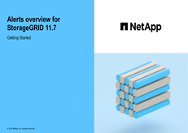

= Benachrichtigungen verwalten: Übersicht
:allow-uri-read: 
:icons: font
:imagesdir: ../media/

[role="lead"]
Das Warnsystem bietet eine benutzerfreundliche Oberfläche zum Erkennen, Bewerten und Beheben von Problemen, die während des StorageGRID-Betriebs auftreten können.

Sie können benutzerdefinierte Warnmeldungen erstellen, Warnmeldungen bearbeiten oder deaktivieren und Warnmeldungen verwalten.

Weitere Informationen:

* Sehen Sie sich das Video an: https://netapp.hosted.panopto.com/Panopto/Pages/Viewer.aspx?id=18df5a3d-bf19-4a9e-8922-afbd009b141b["Video: Übersicht über Warnmeldungen für StorageGRID 11.7"^]
+
[link=https://netapp.hosted.panopto.com/Panopto/Pages/Viewer.aspx?id=18df5a3d-bf19-4a9e-8922-afbd009b141b]

* Sehen Sie sich das Video an: https://netapp.hosted.panopto.com/Panopto/Pages/Viewer.aspx?id=61acb7ba-7683-488a-a689-afb7010088f3["Video: Verwendung von Kennzahlen zum Erstellen von benutzerdefinierten Warnmeldungen in StorageGRID 11.7"^]
+
[link=https://netapp.hosted.panopto.com/Panopto/Pages/Viewer.aspx?id=61acb7ba-7683-488a-a689-afb7010088f3]
image::../media/video-screenshot-alert-create-custom-117.png[Video: Verwendung von Kennzahlen zum Erstellen von benutzerdefinierten Warnmeldungen in StorageGRID 11.7]

* Siehe link:alerts-reference.html["Alerts Referenz"].

