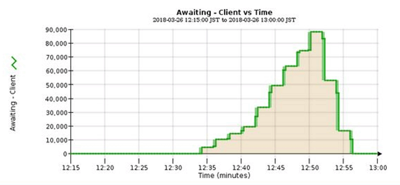

= Überwachung des Information Lifecycle Management
:allow-uri-read: 
:icons: font
:imagesdir: ../media/

[role="lead"]
Das Information Lifecycle Management-System (ILM) ermöglicht Datenmanagement für alle im Grid gespeicherten Objekte. Sie müssen die ILM-Vorgänge überwachen, um nachzuvollziehen, ob das Grid die aktuelle Auslastung handhaben kann oder ob weitere Ressourcen erforderlich sind.

.Über diese Aufgabe
Das StorageGRID System managt Objekte mithilfe der aktiven ILM-Richtlinie. Die ILM-Richtlinie und die zugehörigen ILM-Regeln bestimmen die Anzahl der Kopien, die Art der erstellten Kopien, das Erstellen von Kopien und die Dauer der Aufbewahrung jeder Kopie.

Die Objektaufnahme und andere objektbezogene Aktivitäten können die Geschwindigkeit übersteigen, mit der StorageGRID ILM-Prozesse evaluieren kann, sodass das System Objekte in eine Warteschlange einstellt, deren ILM-Platzierungsanweisungen nicht nahezu in Echtzeit erfüllt werden können. Sie können überwachen, ob StorageGRID mit den Client-Aktionen Schritt hält, indem Sie das Attribut „Warten – Client“ schreiben.

So setzen Sie dieses Attribut auf:

. Melden Sie sich beim Grid Manager an.
. Suchen Sie im Dashboard auf der Registerkarte Information Lifecycle Management (ILM) den Eintrag *waiting - Client*.
. Klicken Sie auf das Diagrammsymbol image:../media/icon_chart_new_for_11_5.png["Diagrammsymbol"].

Das Beispieldiagramm zeigt eine Situation, in der die Anzahl der Objekte, die auf eine ILM-Bewertung warten, vorübergehend nicht aufrechtzuerhalten ist, dann aber gesunken ist. Ein solcher Trend zeigt, dass ILM vorübergehend nicht in Echtzeit erfüllt wurde.

Temporäre Spitzen in der Tabelle von wartet - Client sind zu erwarten. Wenn der in der Grafik angezeigte Wert jedoch weiter steigt und nie sinkt, erfordert das Grid mehr Ressourcen für einen effizienten Betrieb: Entweder mehr Storage-Nodes oder, wenn die ILM-Richtlinie Objekte an Remote-Standorten platziert, erhöht sich die Netzwerkbandbreite.

Mithilfe der Seite *NODES* können Sie sich weiter mit ILM-Warteschlangen beschäftigen.

.Schritte
. Wählen Sie *KNOTEN*.
. Wählen Sie *_Grid Name_* > *ILM* aus.
. Bewegen Sie den Mauszeiger über das ILM-Warteschlangendiagramm, um den Wert der folgenden Attribute zu einem bestimmten Zeitpunkt anzuzeigen:
+
** *Objekte in der Warteschlange (aus Client-Operationen)*: Die Gesamtzahl der Objekte, die auf eine ILM-Bewertung aufgrund von Client-Operationen warten (z. B. Aufnahme).
** *Objekte in der Warteschlange (aus allen Operationen)*: Die Gesamtzahl der Objekte, die auf eine ILM-Bewertung warten.
** *Scan-Rate (Objects/sec)*: Die Geschwindigkeit, mit der Objekte im Raster gescannt und für ILM in die Warteschlange gestellt werden.
** *Evaluationsrate (Objects/sec)*: Die aktuelle Rate, mit der Objekte anhand der ILM-Richtlinie im Grid ausgewertet werden.

. Sehen Sie sich im Abschnitt ILM-Warteschlange die folgenden Attribute an.
+

NOTE: Der Abschnitt ILM-Warteschlange ist nur für das Grid enthalten. Diese Informationen werden auf der Registerkarte ILM für einen Standort oder Storage Node nicht angezeigt.

+
** *Scan Period - Estimated*: Die geschätzte Zeit, um einen vollständigen ILM-Scan aller Objekte abzuschließen.
+

NOTE: Ein vollständiger Scan gewährleistet nicht, dass ILM auf alle Objekte angewendet wurde.

** *Reparairs versuchte*: Die Gesamtzahl der Objektreparaturvorgänge für replizierte Daten, die versucht wurden. Diese Zählung erhöht sich jedes Mal, wenn ein Storage-Node versucht, ein Objekt mit hohem Risiko zu reparieren. Risikobehaftete ILM-Reparaturen werden priorisiert, wenn das Grid besetzt wird.
+

NOTE: Die Reparatur desselben Objekts erhöht sich möglicherweise erneut, wenn die Replikation nach der Reparatur fehlgeschlagen ist.

+
Diese Attribute können nützlich sein, wenn Sie den Fortschritt der Wiederherstellung von Storage Node Volumes überwachen. Wenn die Anzahl der versuchten Reparaturen gestoppt wurde und ein vollständiger Scan abgeschlossen wurde, ist die Reparatur wahrscheinlich abgeschlossen.

