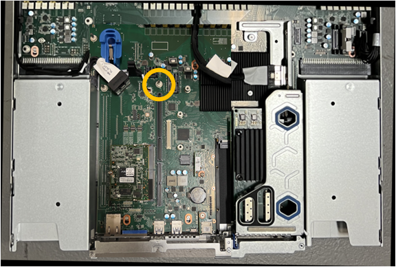

= Ersetzen Sie die CMOS-Batterie des SGF6112
:allow-uri-read: 
:icons: font
:imagesdir: ../media/

[role="lead"]
Gehen Sie wie folgt vor, um die CMOS-Knopfzellenbatterie auf der Systemplatine auszutauschen.

Mit diesen Verfahren können Sie:

* Entfernen Sie die CMOS-Batterie
* Setzen Sie die CMOS-Batterie wieder ein

== Entfernen Sie die CMOS-Batterie

.Bevor Sie beginnen
* Sie haben überprüft, ob die CMOS-Batterie des SGF6112 ausgetauscht werden muss.
+
link:verify-component-to-replace.html["Überprüfen Sie die zu ersetzenKomponenten"]

* Sie haben das SGF6112-Gerät physisch positioniert, in dem Sie die CMOS-Batterie im Rechenzentrum austauschen.
+
link:locating-sgf6112-in-data-center.html["Suchen Sie die Appliance im Datacenter"]

+

NOTE: A link:shut-down-sgf6112.html["Kontrolliertes Herunterfahren des Geräts"] Ist erforderlich, bevor Sie das Gerät aus dem Rack entfernen.

* Sie haben alle Kabel getrennt und die Geräteabdeckung entfernt.
+
link:reinstalling-sgf6112-cover.html["Entfernen Sie die Abdeckung des SGF6112"]

.Über diese Aufgabe
Um Serviceunterbrechungen zu vermeiden, vergewissern Sie sich, dass alle anderen Speicher-Nodes mit dem Stromnetz verbunden sind, bevor Sie den Austausch der CMOS-Batterie starten, oder tauschen Sie die Batterie während eines geplanten Wartungsfensters aus, wenn normalerweise mit Serviceunterbrechungen zu rechnen ist. Weitere Informationen finden Sie unter link:../monitor/monitoring-system-health.html#monitor-node-connection-states["Monitoring der Verbindungsstatus der Nodes"].

IMPORTANT: Wenn Sie jemals eine ILM-Regel verwendet haben, die nur eine Kopie eines Objekts erstellt, müssen Sie die Batterie während eines geplanten Wartungsfensters austauschen. Andernfalls verlieren Sie während dieses Verfahrens vorübergehend den Zugriff auf diese Objekte. Siehe Informationen zu link:../ilm/why-you-should-not-use-single-copy-replication.html["Warum sollten Sie die Single-Copy-Replizierung nicht verwenden"].

.Schritte
. Wickeln Sie das Gurt-Ende des ESD-Armbands um Ihr Handgelenk, und befestigen Sie das Clip-Ende auf einer Metallmasse, um eine statische Entladung zu verhindern.
. Suchen Sie die Steckerbaugruppe mit zwei Steckplätzen an der Rückseite des Geräts.
+
image::../media/SGF6112-two-slot-riser-position.png[Position der Riser mit zwei Steckplätzen]

. Fassen Sie die Riserbaugruppe durch die blau markierten Löcher und heben Sie sie vorsichtig nach oben. Bewegen Sie die Riser-Baugruppe beim Anheben in Richtung Gehäusevorderseite, damit die externen Anschlüsse in den installierten NICs das Gehäuse entfernen können.
. Platzieren Sie die Riserkarte auf einer flachen antistatischen Oberfläche mit der Metallrahmen-Seite nach unten.
. Suchen Sie den CMOS-Akku auf der Systemplatine in der Position unter der entfernten Riserbaugruppe.
+
image::../media/SGF6112-cmos-position.png[Position der CMOS-Batterie]

. Drücken Sie den Halteclip (hervorgehoben) mit dem Finger oder einem Hebelwerkzeug aus Kunststoff von der Batterie weg, um ihn aus der Steckdose zu ziehen.
+
image::../media/SGF6112-battery-cmos.png[CMOS-Batterieclip]

. Entfernen Sie die Batterie, und entsorgen Sie sie ordnungsgemäß.

== Setzen Sie die CMOS-Batterie wieder ein

Setzen Sie den Ersatz-CMOS-Akku in den Sockel auf der Systemplatine ein.

.Bevor Sie beginnen
* Sie haben die richtige Ersatz-CMOS-Batterie (CR2032).
* Sie haben die fehlerhafte CMOS-Batterie entfernt.

.Schritte
. Wickeln Sie das Gurt-Ende des ESD-Armbands um Ihr Handgelenk, und befestigen Sie das Clip-Ende auf einer Metallmasse, um eine statische Entladung zu verhindern.
. Entfernen Sie den CMOS-Akku aus der Verpackung.
. Drücken Sie den Ersatzakku mit der positiven (+) Seite nach oben in den leeren Sockel auf der Systemplatine, bis der Akku einrastet.
. Suchen Sie die Ausrichtungsbohrung auf der Riserbaugruppe mit zwei Steckplätzen (eingekreist), die mit dem Führungsstift auf der Systemplatine ausgerichtet ist, um sicherzustellen, dass die Riserbaugruppe richtig positioniert ist.
+
image::../media/sgf6112_two-slot-riser_alignment_hole.png[Ausrichtungsbohrung der SGF6112-Baugruppe für große Riser]

. Suchen Sie den Führungsstift auf der Systemplatine
+

. Positionieren Sie die Riser-Baugruppe im Gehäuse, und achten Sie darauf, dass sie mit dem Anschluss auf der Systemplatine und dem Führungsstift ausgerichtet ist.
. Drücken Sie die Steckerbaugruppe mit zwei Steckplätzen vorsichtig entlang der Mittellinie neben den blau markierten Löchern, bis sie vollständig eingesetzt ist.
. Wenn Sie keine weiteren Wartungsmaßnahmen im Gerät durchführen müssen, setzen Sie die Geräteabdeckung wieder ein, bringen Sie das Gerät wieder in das Rack ein, schließen Sie die Kabel an und schalten Sie das Gerät mit Strom aus.
. Wenn die Appliance, bei der Sie die Appliance ausgetauscht haben, zur Verschlüsselung von Daten einen Schlüsselverwaltungsserver (KMS) verwendet hat, ist möglicherweise eine zusätzliche Konfiguration erforderlich, bevor der Node dem Grid beitreten kann. Wenn der Node nicht automatisch in das Raster integriert wird, stellen Sie sicher, dass diese Konfigurationseinstellungen auf die neue Appliance übertragen wurden, und konfigurieren Sie manuell alle Einstellungen, die nicht über die erwartete Konfiguration verfügen:
+
** link:../installconfig/accessing-storagegrid-appliance-installer.html["Konfigurieren Sie StorageGRID-Verbindungen"]
** link:../admin/kms-overview-of-kms-and-appliance-configuration.html#set-up-the-appliance["Konfigurieren Sie die Node-Verschlüsselung für die Appliance"]

. Melden Sie sich bei der Appliance an:
+
.. Geben Sie den folgenden Befehl ein: `ssh admin@_grid_node_IP_`
.. Geben Sie das im aufgeführte Passwort ein `Passwords.txt` Datei:
.. Geben Sie den folgenden Befehl ein, um zum Root zu wechseln: `su -`
.. Geben Sie das im aufgeführte Passwort ein `Passwords.txt` Datei:

. Stellen Sie die BMC-Netzwerkverbindung für die Appliance wieder her. Es gibt zwei Möglichkeiten:
+
** Verwenden Sie statische IP, Netzmaske und Gateway
** Verwenden Sie DHCP, um eine IP, eine Netzmaske und ein Gateway zu erhalten
+
... Geben Sie zum Wiederherstellen der BMC-Konfiguration für die Verwendung einer statischen IP, Netzmaske und eines Gateways die folgenden Befehle ein:
+
`*run-host-command ipmitool lan set 1 ipsrc static*`

+
`*run-host-command ipmitool lan set 1 ipaddr _Appliance_IP_*`

+
`*run-host-command ipmitool lan set 1 netmask _Netmask_IP_*`

+
`*run-host-command ipmitool lan set 1 defgw ipaddr _Default_gateway_*`

... Geben Sie den folgenden Befehl ein, um die BMC-Konfiguration so wiederherzustellen, dass DHCP zum Abrufen einer IP, einer Netmask und eines Gateways verwendet wird:
+
`*run-host-command ipmitool lan set 1 ipsrc dhcp*`

. Stellen Sie nach dem Wiederherstellen der BMC-Netzwerkverbindung eine Verbindung zur BMC-Schnittstelle her, um die zusätzlich angewendete benutzerdefinierte BMC-Konfiguration zu prüfen und wiederherzustellen. Sie sollten beispielsweise die Einstellungen für SNMP-Trap-Ziele und E-Mail-Benachrichtigungen bestätigen. Siehe link:../installconfig/configuring-bmc-interface.html["Konfigurieren Sie die BMC-Schnittstelle"].
. Vergewissern Sie sich, dass der Appliance-Node im Grid Manager angezeigt wird und keine Meldungen angezeigt werden.

