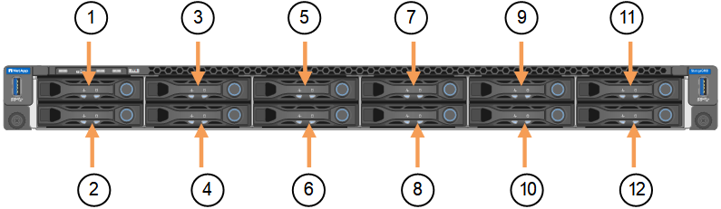

= SGF6112-Gerät austauschen
:allow-uri-read: 
:icons: font
:imagesdir: ../media/

[role="lead"]
Möglicherweise müssen Sie das Gerät austauschen, wenn es nicht optimal funktioniert oder es ausgefallen ist.

.Bevor Sie beginnen
* Sie haben ein Ersatzgerät mit der gleichen Teilenummer wie das Gerät, das Sie austauschen.
* Sie verfügen über Etiketten, um jedes Kabel zu identifizieren, das mit dem Gerät verbunden ist.
* Das ist schon link:locating-sgf6112-in-data-center.html["Das Gerät befindet sich physisch"].

.Über diese Aufgabe
Auf den StorageGRID-Node kann nicht zugegriffen werden, wenn Sie die Appliance ersetzen. Wenn das Gerät ausreichend funktioniert, können Sie zu Beginn dieses Verfahrens eine kontrollierte Abschaltung durchführen.

NOTE: Wenn Sie die Appliance vor der Installation der StorageGRID-Software ersetzen, können Sie nach Abschluss dieses Verfahrens möglicherweise nicht sofort auf den StorageGRID Appliance Installer zugreifen. Sie können zwar von anderen Hosts im selben Subnetz wie die Appliance auf das Installationsprogramm der StorageGRID-Appliance zugreifen, können jedoch nicht von Hosts in anderen Subnetzen darauf zugreifen. Diese Bedingung sollte sich innerhalb von 15 Minuten lösen (wenn ein ARP-Cache-Eintrag für die ursprüngliche Appliance-Zeit vorliegt), oder Sie können den Zustand sofort löschen, indem Sie alle alten ARP-Cache-Einträge manuell vom lokalen Router oder Gateway löschen.

.Schritte
. Zeigt die aktuellen Konfigurationen des Geräts an und zeichnet sie auf.
+
.. Melden Sie sich bei der zu ersetzenden Appliance an:
+
... Geben Sie den folgenden Befehl ein: `ssh admin@_grid_node_IP_`
... Geben Sie das im aufgeführte Passwort ein `Passwords.txt` Datei:
... Geben Sie den folgenden Befehl ein, um zum Root zu wechseln: `su -`
... Geben Sie das im aufgeführte Passwort ein `Passwords.txt` Datei:
+
Wenn Sie als root angemeldet sind, ändert sich die Eingabeaufforderung von `$` Bis `#`.

.. Geben Sie Ein: `*run-host-command ipmitool lan print*` Zeigt die aktuellen BMC-Konfigurationen für die Appliance an.

. Fahren Sie das Gerät herunter:
+
link:shut-down-sgf6112.html["Fahren Sie SGF6112 herunter"]

. Wenn eine der Netzwerkschnittstellen auf dieser StorageGRID-Appliance für DHCP konfiguriert ist, müssen Sie möglicherweise die permanenten DHCP-Lease-Zuordnungen auf den DHCP-Servern aktualisieren, um auf die MAC-Adressen der Ersatz-Appliance zu verweisen, um sicherzustellen, dass der Appliance die erwarteten IP-Adressen zugewiesen werden. Siehe link:../commonhardware/locate-mac-address.html["Aktualisieren Sie die MAC-Adressenverweise"].
. Entfernen und ersetzen Sie das Gerät:
+
.. Beschriften Sie die Kabel und trennen Sie dann die Kabel und alle Netzwerk-Transceiver.
+

IMPORTANT: Um Leistungseinbußen zu vermeiden, sollten Sie die Kabel nicht verdrehen, falten, zusammendrücken oder treten.

.. Entfernen Sie das ausgefallene Gerät aus dem Schrank oder Rack.
.. Notieren Sie sich die Position der austauschbaren Komponenten (zwei Netzteile, acht Lüfter, drei NICs und zwölf SSDs) im ausgefallenen Gerät.
+
Die zwölf Laufwerke befinden sich in den folgenden Positionen im Gehäuse (Vorderseite des Gehäuses mit entfernter Blende):

+

+
|===
|  | Laufwerk 

 a| 
1
 a| 
HDD00

 a| 
2
 a| 
HDD01

 a| 
3
 a| 
HDD02

 a| 
4
 a| 
HDD03

 a| 
5
 a| 
HDD04

 a| 
6
 a| 
HDD05

 a| 
7
 a| 
HDD06

 a| 
8
 a| 
HDD07

 a| 
9
 a| 
HDD08

 a| 
10
 a| 
HDD09

 a| 
11
 a| 
HDD10

 a| 
12
 a| 
HDD11

|===
.. Übertragen Sie die austauschbaren Komponenten auf das Ersatzgerät.
+
Befolgen Sie die Wartungsanweisungen, um die austauschbaren Komponenten wieder einzusetzen.

+

IMPORTANT: Wenn Sie die Daten auf den Laufwerken aufbewahren möchten, müssen Sie die SSD-Laufwerke in die gleichen Laufwerkschächte einsetzen, die sie in der ausgefallenen Appliance belegt haben. Andernfalls zeigt der Appliance Installer eine Warnmeldung an, und Sie müssen die Laufwerke in die richtigen Steckplätze stecken und die Appliance neu starten, bevor die Appliance wieder in das Raster eingesetzt werden kann.

.. Setzen Sie das Ersatzgerät in den Schrank oder Rack ein.
.. Ersetzen Sie die Kabel und optische Transceiver.
.. Schalten Sie das Gerät ein, und warten Sie, bis es wieder in das Stromnetz eingesetzt wird. Wenn die Appliance nicht erneut dem Raster angeschlossen wird, befolgen Sie die Anweisungen auf der Startseite des StorageGRID-Geräteinstallationsprogramms, um Probleme zu beheben.
+

WARNING: Um Datenverluste zu vermeiden, wenn das Appliance Installer anzeigt, dass physische Hardwareänderungen erforderlich sind, z. B. das Verschieben von Festplattenlaufwerken in verschiedene Steckplätze, schalten Sie die Appliance vor Hardwareänderungen aus.

. Wenn die Appliance, bei der Sie die Appliance ausgetauscht haben, zur Verschlüsselung von Daten einen Schlüsselverwaltungsserver (KMS) verwendet hat, ist möglicherweise eine zusätzliche Konfiguration erforderlich, bevor der Node dem Grid beitreten kann. Wenn der Node nicht automatisch in das Raster integriert wird, stellen Sie sicher, dass diese Konfigurationseinstellungen auf die neue Appliance übertragen wurden, und konfigurieren Sie manuell alle Einstellungen, die nicht über die erwartete Konfiguration verfügen:
+
** link:../installconfig/accessing-storagegrid-appliance-installer.html["Konfigurieren Sie StorageGRID-Verbindungen"]
** link:../admin/kms-overview-of-kms-and-appliance-configuration.html#set-up-the-appliance["Konfigurieren Sie die Node-Verschlüsselung für die Appliance"]

. Melden Sie sich bei der ersetzten Appliance an:
+
.. Geben Sie den folgenden Befehl ein: `ssh admin@_grid_node_IP_`
.. Geben Sie das im aufgeführte Passwort ein `Passwords.txt` Datei:
.. Geben Sie den folgenden Befehl ein, um zum Root zu wechseln: `su -`
.. Geben Sie das im aufgeführte Passwort ein `Passwords.txt` Datei:

. Stellen Sie die BMC-Netzwerkverbindung für die ersetzte Appliance wieder her. Es gibt zwei Möglichkeiten:
+
** Verwenden Sie statische IP, Netzmaske und Gateway
** Verwenden Sie DHCP, um eine IP, eine Netzmaske und ein Gateway zu erhalten
+
... Geben Sie zum Wiederherstellen der BMC-Konfiguration für die Verwendung einer statischen IP, Netzmaske und eines Gateways die folgenden Befehle ein:
+
`*run-host-command ipmitool lan set 1 ipaddr _Appliance_IP_*`

+
`*run-host-command ipmitool lan set 1 netmask _Netmask_IP_*`

+
`*run-host-command ipmitool lan set 1 defgw ipaddr _Default_gateway_*`

... Geben Sie den folgenden Befehl ein, um die BMC-Konfiguration so wiederherzustellen, dass DHCP zum Abrufen einer IP, einer Netmask und eines Gateways verwendet wird:
+
`*run-host-command ipmitool lan set 1 ipsrc dhcp*`

. Stellen Sie nach dem Wiederherstellen der BMC-Netzwerkverbindung eine Verbindung zur BMC-Schnittstelle her, um die zusätzlich angewendete benutzerdefinierte BMC-Konfiguration zu prüfen und wiederherzustellen. Sie sollten beispielsweise die Einstellungen für SNMP-Trap-Ziele und E-Mail-Benachrichtigungen bestätigen. Siehe link:../installconfig/configuring-bmc-interface.html["Konfigurieren Sie die BMC-Schnittstelle"].
. Vergewissern Sie sich, dass der Appliance-Node im Grid Manager angezeigt wird und keine Meldungen angezeigt werden.

.Verwandte Informationen
link:../installconfig/installing-appliance-in-cabinet-or-rack-sgf6112.html["Appliance in einem Schrank oder Rack installieren (SGF6112)"]

link:../installconfig/viewing-status-indicators.html["Statusanzeigen anzeigen anzeigen anzeigen"]

link:../installconfig/viewing-error-codes-for-sgf6112.html["Anzeigen von Startcodes für die Appliance"]

Nach dem Austausch des Teils senden Sie das fehlerhafte Teil an NetApp zurück, wie in den mit dem Kit gelieferten RMA-Anweisungen beschrieben. Siehe https://["Teilerückgabe  Austausch"^] Seite für weitere Informationen.
